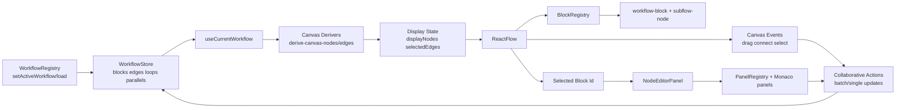

# Workflow Editor Refactor Plan

## 1) Executive Summary
- Refactor the TradingGoose canvas to use the same render pipeline shape as `../sim/apps/sim/app/workspace/[workspaceId]/w/[workflowId]/workflow.tsx`: deterministic `blocks -> derivedNodes/edges -> displayNodes/edgesForDisplay -> ReactFlow` with explicit selection and drag lifecycle boundaries.
- Introduce a TradingGoose `BlockRegistry` + renderer adapter layer so canvas node rendering is config-driven instead of hard-wired in `apps/tradinggoose/widgets/widgets/editor_workflow/components/workflow-editor/workflow-canvas.tsx`.
- Adopt sim-style hydration **behavioral parity** in TradingGoose workflow registry (`metadata-loading`, `metadata-ready`, `state-loading`, `ready`, `error`) while preserving existing channel routing semantics and collaborative socket protocol; this plan does not require sim public-API parity.
- Define hydration and request tracking as channel-keyed state in TradingGoose registry so each channel has isolated phase transitions and stale-request protection.
- Preserve current TradingGoose block visuals in canvas and preview nodes; adopt `../next-app` editor composition/dispatch conventions from `node-editor-panel.tsx` plus token/accessibility patterns from UI primitives (`components/ui/button.tsx`, `input.tsx`, `field.tsx`, `sidebar.tsx`), implemented as a docked right-side panel in TradingGoose (not a floating ReactFlow panel).
- Split current monoliths into small modules while reducing total complexity: `workflow-canvas.tsx` (2132 lines), `workflow-block.tsx` (1431 lines), `sub-block.tsx` (683 lines).
- Preserve current TradingGoose functional behavior during rollout: trigger constraints (canonical duplicate-only policy, no legacy trigger mode), diff rendering, loop/parallel behavior, training controls, widget embedding, preview/deployed-preview rendering compatibility, and channel-scoped workflow stores.
- End-state requirement: remove in-node editors completely across all surfaces (editor canvas, workspace preview, and deployed-preview); block editing exists only in the side panel on canonical path. Sequencing rule: editor-canvas pilot-type removal happens in Phase 2, and preview/deployed-preview removal is completed only at the Phase 3 runtime cutover checkpoint.
- Keep single-edge selection behavior for first release; multi-edge edge-selection parity with sim is intentionally out of initial scope.
- Use phased migration with one canonical renderer/editor path as the end-state; remove temporary migration scaffolding before completion.
- Do not keep parallel versioned renderers in the codebase after refactor completion.
- Execution sequencing instruction (February 27, 2026): execute Phase 0A contract-sync steps first, then execute Phase 1 immediately after Phase 0A completion. Execute Phase 0B safety hardening (channel-safety/loading/trigger/workflow-editor event-bus core) during Phase 1-2, and complete it before Phase 3 starts.

## Instruction Mode (Authoritative)
- This document is an implementation instruction sequence, not a pre-start readiness checklist.
- Start executing the current phase immediately, even when kickoff audit counts are red; red counts are expected burn-down input for that phase.
- Treat audit commands as progress telemetry while implementing; treat them as pass/fail only at the explicit phase-transition boundary defined in this document.
- Do not stop phase execution because reviewers report current-file mismatches; convert each mismatch into the corresponding step’s concrete code change and continue.
- The only stop conditions are explicit phase-transition checkpoints (for example, Phase 0A -> Phase 1, Phase 2 -> Phase 3, and final Phase 5 sign-off).

## 2) Current State (TradingGoose)
### Architecture map
- Entry and providers:
- `apps/tradinggoose/widgets/widgets/editor_workflow/index.tsx`
- `apps/tradinggoose/widgets/widgets/editor_workflow/components/workflow-editor-app.tsx`
- `apps/tradinggoose/widgets/widgets/editor_workflow/components/workflow.tsx`
- `apps/tradinggoose/widgets/widgets/editor_workflow/context/workflow-route-context.tsx`
- `apps/tradinggoose/widgets/widgets/editor_workflow/context/workflow-ui-context.tsx`
- Canvas and render surface:
- `apps/tradinggoose/widgets/widgets/editor_workflow/components/workflow-editor/workflow-canvas.tsx`
- `apps/tradinggoose/widgets/widgets/editor_workflow/components/workflow-edge/workflow-edge.tsx`
- `apps/tradinggoose/widgets/widgets/editor_workflow/components/subflows/subflow-node.tsx`
- In-canvas block editor:
- `apps/tradinggoose/widgets/widgets/editor_workflow/components/workflow-block/workflow-block.tsx`
- `apps/tradinggoose/widgets/widgets/editor_workflow/components/workflow-block/components/sub-block/sub-block.tsx`
- `apps/tradinggoose/widgets/widgets/editor_workflow/components/workflow-block/components/sub-block/components/*`
- Data/state layer:
- `apps/tradinggoose/hooks/workflow/use-current-workflow.ts`
- `apps/tradinggoose/hooks/use-collaborative-workflow.ts`
- `apps/tradinggoose/stores/workflows/workflow/store.ts`
- `apps/tradinggoose/stores/workflows/workflow/store-client.tsx`
- `apps/tradinggoose/stores/workflows/workflow/types.ts`
- `apps/tradinggoose/stores/workflows/registry/store.ts`

### Current render flow (entry -> canvas -> block -> editor UI)
- `index.tsx` configures widget-level UI and injects `WorkflowEditorApp`.
- `workflow-editor-app.tsx` composes providers, socket, route context, and `WorkflowStoreProvider`.
- `workflow.tsx` wraps `WorkflowCanvas` in `ReactFlowProvider` + error boundary and merges UI config.
- `workflow-canvas.tsx` maps workflow store blocks/edges into ReactFlow nodes/edges inline, handles drag/drop/connect, and renders `WorkflowBlock`/`SubflowNodeComponent`/`WorkflowEdge` directly.
- `workflow-block.tsx` renders block frame + handles + block actions + subblock editor controls in one component.
- `sub-block.tsx` performs type-switch rendering into many concrete input components under `components/sub-block/components/*`.

### Pain points / constraints observed in code
- Canvas orchestration is concentrated in one file (`workflow-canvas.tsx`) with mixed responsibilities: hydration, node/edge derivation, drag/reparent, connection logic, keyboard shortcuts, UI overlays, and selection.
- `onNodesChange` in TradingGoose only persists position changes and does not use a full selection reconciliation pipeline (`apps/tradinggoose/widgets/widgets/editor_workflow/components/workflow-editor/workflow-canvas.tsx`).
- Edge selection is single-item (`selectedEdgeInfo`) rather than map-based multi-select (`apps/tradinggoose/widgets/widgets/editor_workflow/components/workflow-editor/workflow-canvas.tsx`).
- Toolbar-to-canvas add-block uses a global window custom event (`add-block-from-toolbar`) in `toolbar-block.tsx`, `toolbar-loop-block.tsx`, `toolbar-parallel-block.tsx`, and `workflow-canvas.tsx`, which creates cross-widget coupling.
- Window-event coupling is still widespread across workflow-editor paths (`workflow-canvas.tsx`, `use-collaborative-workflow.ts`, `action-bar.tsx`, `workflow-block.tsx`, `schedule-config.tsx`), including `workflow-record-*`, `skip-edge-recording`, `remove-from-subflow`, `update-subblock-value`, and `schedule-updated`; this validates that Phase 0B workflow-editor event-bus core cleanup is mandatory before Phase 3, with residual/app-wide verification in Phase 5.
- UI config contract is currently aligned between `workflow-ui-context.tsx` and `workflow-canvas.tsx` on the canonical key set (`floatingControls`, `trainingControls`, `forceTrainingControls`, `diffControls`, `triggerList`, `controlBar`); preserve this set and do not introduce a `panel` config key.
- Trigger conflict handling has partial drift: `apps/tradinggoose/lib/workflows/triggers.ts` and `workflow-canvas.tsx` are already duplicate-only, but `trigger-warning-dialog.tsx` still carries legacy trigger wording/branching (`LEGACY_INCOMPATIBILITY`, "Cannot mix trigger types", and legacy Start-block copy) that must be removed.
- In-canvas block editing is tightly coupled and ResizeObserver-driven in `workflow-block.tsx`, while subblock rendering relies on a large switch in `sub-block.tsx`.
- Workspace preview surface (`apps/tradinggoose/app/workspace/[workspaceId]/components/workflow-preview/workflow-preview.tsx`) still renders `WorkflowBlock` directly with preview subblock payload assumptions; this is an expected interim dependency in Phases 0-2 and is not a blocker for proceeding. Required removal happens at the Phase 3 canonical preview cutover checkpoint.
- Workspace preview currently contains explicit route-context fallback/guard behavior (notably in `workflow-preview.tsx` around existing fallback branches), and deployed preview embeds this surface (`deployed-workflow-card.tsx`); migration must preserve these guards so deployed preview remains safe outside workspace-route context.
- Subflow node styling includes global injected CSS/animation in `subflow-node.tsx`, which complicates styling consistency.
- Registry/store loading differs from sim hydration-state approach: TradingGoose uses channel-based active workflow maps, `workflowCache`, and `pendingRequests` in `apps/tradinggoose/stores/workflows/registry/store.ts`.
- Current registry does not define channel-keyed hydration objects or channel-keyed request IDs (`apps/tradinggoose/stores/workflows/registry/types.ts`), which makes “mirror sim hydration fully” ambiguous for multi-channel workflows.

## 3) Reference Patterns to Emulate
### `../sim` block rendering and canvas pipeline
- Canvas lifecycle and rendering pipeline in `../sim/apps/sim/app/workspace/[workspaceId]/w/[workflowId]/workflow.tsx`:
- Active workflow hydration via `useWorkflowRegistry` + `setActiveWorkflow` with explicit hydration phases.
- `useCurrentWorkflow` abstraction for normal/diff/snapshot view: `../sim/apps/sim/app/workspace/[workspaceId]/w/[workflowId]/hooks/use-current-workflow.ts`.
- Deterministic node derivation (`derivedNodes`) plus local `displayNodes` for drag smoothness.
- Selection management using parent-child conflict resolution from `../sim/apps/sim/app/workspace/[workspaceId]/w/[workflowId]/utils/workflow-canvas-helpers.ts`.
- Connect lifecycle with `onConnectStart`, `onConnect`, `onConnectEnd` in `workflow.tsx`.
- Container-aware drag/reparent logic using utilities in `../sim/apps/sim/app/workspace/[workspaceId]/w/[workflowId]/hooks/use-node-utilities.ts` and `../sim/apps/sim/app/workspace/[workspaceId]/w/[workflowId]/utils/node-position-utils.ts`.
- Edge rendering with diff + execution status in `../sim/apps/sim/app/workspace/[workspaceId]/w/[workflowId]/components/workflow-edge/workflow-edge.tsx`.
- Deterministic block sizing hook (`useBlockDimensions`) in `../sim/apps/sim/app/workspace/[workspaceId]/w/[workflowId]/hooks/use-block-dimensions.ts`.
- Preview architecture pattern to mirror:
- Dedicated preview canvas uses `PreviewWorkflow` with `PreviewBlock` / `PreviewSubflow` node types (not `workflow-block`): `../sim/apps/sim/app/workspace/[workspaceId]/w/components/preview/components/preview-workflow/preview-workflow.tsx`.
- Dedicated preview editor uses readonly guards/styles and `isPreview`/`disabled` semantics: `../sim/apps/sim/app/workspace/[workspaceId]/w/components/preview/components/preview-editor/preview-editor.tsx`.
- Store/model patterns to borrow:
- Hydration request-id guard and phase machine in `../sim/apps/sim/stores/workflows/registry/store.ts`.
- Batch collaborative operations in `../sim/apps/sim/hooks/use-collaborative-workflow.ts`.
- Richer optional block metadata (`locked`, `canonicalModes`, batch actions) in `../sim/apps/sim/stores/workflows/workflow/types.ts`.

### `../next-app` block editor UI system and component patterns
- Theme/token system:
- `../next-app/app/globals.css` (CSS vars, Tailwind tokens, shadcn/radix integration).
- `../next-app/components.json` (`radix-nova`, CSS variables enabled).
- Node definition/registry contract (for editor schema/dispatch patterns):
- `../next-app/types/workflow.ts` (`NodeDefinition`, `shared/client/server`).
- `../next-app/lib/workflow/nodes/index.ts` (`nodeRegistry`, typed lookup).
- Node triad pattern examples:
- `../next-app/lib/workflow/nodes/start/*`
- `../next-app/lib/workflow/nodes/agent/*`
- `../next-app/lib/workflow/nodes/if-else/*`
- Editor UX modules:
- `../next-app/components/node-editor-panel.tsx` (definition-driven panel component dispatch shell; use as composition/reference only, not as floating layout behavior).
- Use this as the visual/layout pattern for TradingGoose preview inspector, with TradingGoose-specific read-only contract (`readOnly=true` required in preview surfaces).
- `../next-app/components/editor/condition-editor.tsx` + `../next-app/components/editor/condition-editor.css` (inline expression editor + variable/operator popovers).
- Accessibility and keyboard patterns:
- `../next-app/components/ui/button.tsx`, `input.tsx`, `select.tsx`, `popover.tsx`, `tooltip.tsx`, `field.tsx` (focus-visible, aria-invalid, data-slot semantics).
- `../next-app/components/ui/sidebar.tsx` keyboard shortcut pattern (`Cmd/Ctrl + key`).

## 4) Gap Analysis
### Rendering architecture gaps (TradingGoose vs `../sim`)
- TradingGoose lacks a dedicated renderer adapter layer; block and edge derivation are embedded directly in canvas.
- TradingGoose uses single-edge selection state; this remains acceptable for first release while parent-child node selection conflict handling is still migrated.
- TradingGoose does not implement `onConnectStart/onConnectEnd` pair behavior for body-drop connect fallback.
- TradingGoose uses window-level event dispatch for adding blocks; sim keeps canvas actions in hook/menu abstractions.
- TradingGoose store/collab path is mostly single-item operations; sim uses batch-first collaborative primitives for drag/multi-select operations.
- TradingGoose container geometry utilities exist (`components/utils.ts`) but are less explicit about content padding clamp behavior than sim’s node position helpers.

### Editor UI/style gaps (TradingGoose vs `../next-app`)
- TradingGoose editing happens inside each block node; next-app separates node rendering and panel editing with definition-driven dispatch. Refactor keeps TradingGoose node visuals, adopts next-app panel patterns, and uses a docked right-side panel layout in TradingGoose.
- TradingGoose uses older UI primitive styling conventions (`apps/tradinggoose/components/ui/*`) versus next-app’s `data-slot` + `aria-*` + tokenized classes.
- TradingGoose condition editing (`condition-input.tsx`) is Monaco-based inline logic; migration will keep Monaco and align only layout/components/patterns (not editor engine or advanced-mode branches).
- TradingGoose currently has no registry-driven panel dispatch pattern equivalent to `node-editor-panel.tsx`.

### Data model/type gaps
- TradingGoose block/store types are missing optional fields used in sim’s rendering workflows (`locked`, canonical mode support, explicit batch actions).
- TradingGoose `use-current-workflow` supports normal/diff but not sim-style snapshot baseline mode abstraction.
- UI config must preserve the current canonical key set (`floatingControls`, `trainingControls`, `forceTrainingControls`, `diffControls`, `triggerList`, `controlBar`); side-panel visibility/selection state must be editor-local state (not a `WorkflowCanvasUIConfig.panel` key).
- TradingGoose registry types use `activeWorkflowIds` and `loadedWorkflowIds` but no `hydrationByChannel` contract, while sim uses a single explicit `hydration` object (`../sim/apps/sim/stores/workflows/registry/types.ts`); this mismatch must be resolved explicitly.

### Component/module mapping table
| TradingGoose current module | Proposed equivalent (inspired by `../sim` / `../next-app`) | Notes |
|---|---|---|
| `apps/tradinggoose/widgets/widgets/editor_workflow/components/workflow-editor/workflow-canvas.tsx` | `workflow-canvas.tsx` slim coordinator + `canvas/*` helpers (`derive-nodes`, `derive-edges`, `selection`, `connection`, `parenting`) | Keep file entrypoint stable; move logic out incrementally. |
| `apps/tradinggoose/widgets/widgets/editor_workflow/components/workflow-block/workflow-block.tsx` | canonical render-only `workflow-block` with existing TradingGoose visual style + registry adapter hooks | Preserve block visuals; remove embedded editors and route editing to side panel. |
| `apps/tradinggoose/widgets/widgets/editor_workflow/components/workflow-block/components/sub-block/sub-block.tsx` | `workflow-editor/panel/panel-registry.ts` (new) + per-type side panel components | Move editing out of node body into side panel. |
| `apps/tradinggoose/widgets/widgets/editor_workflow/components/workflow-block/components/sub-block/components/condition-input.tsx` | `workflow-editor/panel/panels/condition-panel.tsx` (new, Monaco-backed) | Keep Monaco behavior, but host it in side panel. |
| `apps/tradinggoose/widgets/widgets/editor_workflow/components/workflow-edge/workflow-edge.tsx` | Keep path; upgrade data contract for execution/diff parity while retaining single-edge selection in release 1 | Preserve existing edge component path to limit churn. |
| `apps/tradinggoose/widgets/widgets/editor_workflow/components/utils.ts` | `workflow-editor/canvas/node-position-utils.ts` (new) + `workflow-editor/canvas/selection-manager.ts` (new) | Extract and specialize utilities to canvas domain. |
| `apps/tradinggoose/widgets/widgets/editor_workflow/components/toolbar/toolbar-block/toolbar-block.tsx` | callback-driven add-block API via canvas action context | Remove global `window` event dependency. |
| `apps/tradinggoose/widgets/widgets/editor_workflow/components/toolbar/toolbar-loop-block/toolbar-loop-block.tsx` | callback-driven add-block API via canvas action context | Remove global `window` event dependency. |
| `apps/tradinggoose/widgets/widgets/editor_workflow/components/toolbar/toolbar-parallel-block/toolbar-parallel-block.tsx` | callback-driven add-block API via canvas action context | Remove global `window` event dependency. |
| `apps/tradinggoose/hooks/use-collaborative-workflow.ts` | add batch wrappers (`collaborativeBatchUpdatePositions`, `collaborativeBatchUpdateParent`) | Match sim behavior for multi-drag and selection ops. |
| `apps/tradinggoose/stores/workflows/workflow/types.ts` | additive optional fields and batch action signatures aligned to migration needs | Keep stored schema backward-compatible (optional only). |
| `apps/tradinggoose/stores/workflows/registry/types.ts` + `apps/tradinggoose/stores/workflows/registry/store.ts` | channel-keyed hydration contract (`hydrationByChannel`) + requestId guards per channel | Preserve channel architecture while mirroring sim hydration phases. |
| `apps/tradinggoose/widgets/widgets/editor_workflow/context/workflow-ui-context.tsx` | align UI config with `WorkflowCanvasUIConfig` authoritative type | Remove stray keys and type drift. |
| `apps/tradinggoose/app/workspace/[workspaceId]/components/workflow-preview/workflow-preview.tsx` | canonical read-only preview stack: dedicated preview renderer + next-app-style read-only inspector panel (no `WorkflowBlock`/`sub-block` editor path) | Preserve workspace/deployed preview rendering while removing in-node editors. |

## 5) Target Architecture Proposal
### Proposed TradingGoose module boundaries
- Canvas renderer core:
- `apps/tradinggoose/widgets/widgets/editor_workflow/components/workflow-editor/canvas/block-registry.ts` (new)
- `apps/tradinggoose/widgets/widgets/editor_workflow/components/workflow-editor/canvas/derive-canvas-nodes.ts` (new)
- `apps/tradinggoose/widgets/widgets/editor_workflow/components/workflow-editor/canvas/derive-canvas-edges.ts` (new)
- `apps/tradinggoose/widgets/widgets/editor_workflow/components/workflow-editor/canvas/connection-manager.ts` (new)
- `apps/tradinggoose/widgets/widgets/editor_workflow/components/workflow-editor/canvas/parenting-manager.ts` (new)
- `apps/tradinggoose/widgets/widgets/editor_workflow/components/workflow-editor/canvas/selection-manager.ts` (new)
- `apps/tradinggoose/widgets/widgets/editor_workflow/components/workflow-editor/canvas/node-position-utils.ts` (new)
- Block render modules (TradingGoose visual style preserved) + side editor panel modules:
- `apps/tradinggoose/widgets/widgets/editor_workflow/components/workflow-block/workflow-block.tsx` (canonical render-only implementation with current TradingGoose node visuals)
- `apps/tradinggoose/widgets/widgets/editor_workflow/components/workflow-editor/panel/node-editor-panel.tsx` (new)
- `apps/tradinggoose/widgets/widgets/editor_workflow/components/workflow-editor/panel/panel-registry.ts` (new)
- `apps/tradinggoose/widgets/widgets/editor_workflow/components/workflow-editor/panel/panels/*.tsx` (new panel modules)
- Preview renderer + read-only inspector modules (creation ownership is Phase 2 only; Phase 1 must not create these files):
- `apps/tradinggoose/widgets/widgets/editor_workflow/components/workflow-editor/preview/preview-workflow.tsx` (new, dedicated preview ReactFlow surface; created in Phase 2)
- `apps/tradinggoose/widgets/widgets/editor_workflow/components/workflow-editor/preview/preview-node.tsx` (new, dedicated preview node component; created in Phase 2)
- `apps/tradinggoose/widgets/widgets/editor_workflow/components/workflow-editor/preview/read-only-node-editor-panel.tsx` (new, next-app-style panel layout with strict read-only behavior; created in Phase 2)
- `apps/tradinggoose/widgets/widgets/editor_workflow/components/workflow-editor/preview/preview-panel-registry.ts` (new, read-only panel mapping; created in Phase 2)
- `apps/tradinggoose/widgets/widgets/editor_workflow/components/workflow-editor/preview/preview-payload-adapter.ts` (new, normalize preview payloads for read-only renderer/panel; created in Phase 2)
- Store/persistence boundaries:
- Keep persistence in `apps/tradinggoose/hooks/use-collaborative-workflow.ts` and `apps/tradinggoose/stores/workflows/workflow/store.ts`.
- Keep registry/hydration boundary in `apps/tradinggoose/stores/workflows/registry/store.ts`.
- Canvas-local transient state remains local to canvas (`displayNodes`, hover/selection contexts, drag targets).

### Block component contract (new)
```ts
export type CanvasBlockRendererProps = {
  blockId: string
  block: BlockState
  config: BlockConfig
  selected: boolean
  hovered: boolean
  readOnly: boolean
  isDiffMode: boolean
  isPreview: boolean
  onSelect: (blockId: string, additive?: boolean) => void
  onOpenEditorPanel: (blockId: string) => void
}

export type CanvasNodeType = 'workflowBlock' | 'subflowNode' | 'noteBlock'

export type CanvasHandle = {
  id: string
  kind: 'source' | 'target'
  position: string
}

export type CanvasBlockRegistryEntry = {
  nodeType: CanvasNodeType
  component: React.ComponentType<CanvasBlockRendererProps>
  estimateDimensions: (block: BlockState) => { width: number; height: number }
  getHandles: (block: BlockState) => Array<CanvasHandle>
}

export type CanvasBlockRegistry = Record<string, CanvasBlockRegistryEntry>

export type EditorPanelProps = {
  blockId: string
  readOnly: boolean
}

export type EditorPanelRegistryEntry = {
  component: React.ComponentType<EditorPanelProps>
}

export type EditorPanelRegistry = Record<string, EditorPanelRegistryEntry>
```
- Contract rule: preview/deployed-preview surfaces must instantiate panel components with `readOnly=true` only and may not pass mutation callbacks or write-capable store actions.

### State management and persistence boundaries
- ReactFlow local state:
- `displayNodes`, temporary drag positions, hover targets, active connection draft, pending selection.
- Editor panel local state:
- `selectedBlockId`, panel open/close, panel tab state.
- Registry hydration state:
- `hydrationByChannel[channelKey]` is the source of truth for channel workflow load lifecycle.
- Request IDs are evaluated per channel to discard stale workflow state loads.
- Workflow store persistent state:
- block/edge topology, block subblock data, loop/parallel config, measured layout metrics.
- Collaborative boundary:
- all persistent mutations go through `useCollaborativeWorkflow` wrappers.
- batch wrappers are introduced for drag multi-select and parent changes; single-item methods remain available for non-batch events.

### Channel-keyed hydration contract (concrete)
```ts
export type HydrationPhase =
  | 'idle'
  | 'metadata-loading'
  | 'metadata-ready'
  | 'state-loading'
  | 'ready'
  | 'error'

export type ChannelHydrationState = {
  phase: HydrationPhase
  workspaceId: string | null
  workflowId: string | null
  requestId: string | null
  error: string | null
}

export type WorkflowRegistryState = {
  workflows: Record<string, WorkflowMetadata>
  activeWorkflowIds: Record<string, string>
  loadedWorkflowIds: Record<string, boolean>
  hydrationByChannel: Record<string, ChannelHydrationState>
  deploymentStatuses: Record<string, DeploymentStatus>
  // canonical global metadata-loading indicator
  isLoading: boolean
  error: string | null
}
```
- Bootstrap constant (required):
- `WORKSPACE_BOOTSTRAP_CHANNEL = '__workspace__'` is a reserved metadata-only pseudo-channel key used only when no real channel hydration entries exist yet.

### Channel-keyed hydration algorithm (concrete)
- `loadWorkflows` canonical API contract (required, sim-style explicitness):
- Signature must be exactly `loadWorkflows(params: { workspaceId: string; channelId?: string }): Promise<void>`.
- Do not keep or introduce overloads/aliases like `loadWorkflows(workspaceId?: string)`; remove string-form usage in the same Phase 0 contract-sync pass.
- This follows sim’s explicit hydration-phase model, implemented through canonical registry operations (`loadWorkflows`, `switchToWorkspace`, `setActiveWorkflow`) rather than overloaded/implicit APIs.
- `setActiveWorkflow({ workflowId, channelId })` (canonical, locked):
- Do not expose caller-level skip flags; skip/short-circuit behavior must remain internal to registry logic (sim-style) based on current hydration state.
- Resolve `channelKey` using the same canonical resolver used by workflow store channel binding (`resolveChannelKey`/`resolveChannelId` parity).
- Generate `requestId` and set `hydrationByChannel[channelKey]` to `state-loading` for the target workflow.
- Fetch workflow state (network fetch may still be deduplicated by `workflowId`).
- Keep network dedupe (`pendingRequests`) separate from hydration staleness checks; staleness is channel-keyed and enforced via `hydrationByChannel[channelKey].requestId`.
- Before applying result, verify `hydrationByChannel[channelKey].requestId === requestId` and `workflowId` still matches target.
- If check fails, discard as stale and do not mutate channel store.
- If check passes, write workflow state to the channel-bound workflow store (`useWorkflowStore.setStateForChannel(...)`), update `activeWorkflowIds[channelKey]`, set `loadedWorkflowIds[channelKey] = true`, then set `hydrationByChannel[channelKey].phase = ready`.
- `switchToWorkspace(workspaceId)`:
- If at least one real channel entry exists in `hydrationByChannel` (keys other than `WORKSPACE_BOOTSTRAP_CHANNEL`), set all those real channel entries to `metadata-loading`.
- If no real channel entries exist, create/update `hydrationByChannel[WORKSPACE_BOOTSTRAP_CHANNEL]` with `phase = metadata-loading`, `workspaceId`, `workflowId = null`, `requestId = null`, `error = null`.
- Delegate metadata fetch lifecycle to `loadWorkflows({ workspaceId })` after target-channel preparation so both workspace switch and direct metadata consumers use the same metadata-loading transition path.
- After metadata load succeeds, set all metadata-loading entries touched by this workspace switch to `metadata-ready`.
- Keep `WORKSPACE_BOOTSTRAP_CHANNEL` only until the first real channel begins hydration (`state-loading`) or reaches `ready`, then remove the bootstrap entry in the same transaction.
- Preserve per-channel `activeWorkflowIds` semantics; each channel independently transitions to `state-loading/ready` when activated.
- `loadWorkflows({ workspaceId, channelId? })`:
- Resolve metadata target channels deterministically:
- If `channelId` is provided, target only the resolved real channel key.
- If `channelId` is omitted and at least one real channel hydration entry exists, target all real channel keys.
- If `channelId` is omitted and no real channel hydration entry exists, target only `WORKSPACE_BOOTSTRAP_CHANNEL`.
- Generate metadata `requestId` and set every target to `metadata-loading` (`workspaceId`, `workflowId = null`, `requestId`, `error = null`) before issuing metadata fetch.
- This is the required path for direct metadata consumers (`list_workflow`, `workflow-dropdown`); callers do not toggle `isLoading` manually.
- On success, apply metadata cache updates, then for each target channel confirm `hydrationByChannel[target].requestId === requestId`; discard stale targets and update matching targets to `metadata-ready`.
- On failure, for each target channel with matching `requestId`, set `phase = error` with channel-scoped error message.
- `loadWorkflows` must not mutate `activeWorkflowIds`, `loadedWorkflowIds`, or channel-bound workflow-state payloads.
- `isLoading` canonical field:
- Derive from metadata phase only: `isLoading === true` iff any `hydrationByChannel[*].phase === 'metadata-loading'` (including `WORKSPACE_BOOTSTRAP_CHANNEL` during pre-channel metadata bootstrap).
- Do not set `isLoading` for `state-loading`; channel workflow hydration state is read via `getHydration(channelId)` / `isChannelHydrating(channelId)`.
- Error handling:
- Any channel load error sets `hydrationByChannel[channelKey]` to `error` with channel-specific message.
- A stale result must never overwrite another channel’s hydration state.

### Sim parity mapping (locked)
- Primary sim reference (behavioral source of truth): `../sim/apps/sim/stores/workflows/registry/types.ts` and `../sim/apps/sim/stores/workflows/registry/store.ts`.
- Channel-mode adaptation rule (TradingGoose): sim has one `hydration` object; TradingGoose must apply the same phase machine per resolved channel key (`default`, `pair-*`, and explicit channel IDs) via `hydrationByChannel[channelKey]`.
- Operation parity mapping (required):
- Sim `beginMetadataLoad` / `completeMetadataLoad` / `failMetadataLoad` behavior maps to TradingGoose internal metadata transitions inside canonical operations (`loadWorkflows`, `switchToWorkspace`) with identical phase semantics (`metadata-loading` -> `metadata-ready` / `error`).
- Sim `setActiveWorkflow` internal skip (already active + ready + data present) maps to TradingGoose internal per-channel skip logic; do not expose caller flags for skip.
- Sim `loadWorkflowState` requestId stale-result discard maps to TradingGoose per-channel requestId checks; apply state only when requestId/workflow match for that channel.
- Sim `switchToWorkspace` reset + metadata-loading initialization maps to TradingGoose workspace switch across known channels, with `WORKSPACE_BOOTSTRAP_CHANNEL` only when no real channels exist.
- Channel isolation invariants (required):
- A transition in channel A must never mutate channel B hydration/workflow payload.
- Metadata transitions must not mutate `activeWorkflowIds`/`loadedWorkflowIds`; state-loading/ready transitions own those mutations.
- `isLoading` remains metadata-only aggregate across channels; channel readiness/routing must use channel hydration selectors.

### Data + render flow diagram


## 6) Step-by-Step Migration Plan (Phased)
### Dependency and sequence rules
1. Execution sequence rule: execute the plan in order as an instruction flow (not a startup checklist) with two transition checkpoints. Execute Phase 0A first, then begin Phase 1 immediately after Phase 0A completion. Execute Phase 0B safety hardening during Phases 1-2 and complete it before Phase 3. Full-manifest channel-safety zero is a Phase 5 final sign-off requirement.
1a. Phase 0A transition rule (non-optional): current remaining contract/signature/context mismatches captured by the Phase 0A audit commands (registry API shape normalization, caller call-shape normalization, and copilot execution-context provenance wiring) are expected Phase 0A workload. Continue Phase 0A execution until closure gates are satisfied, then transition to Phase 1.
1b. Kickoff interpretation rule (authoritative): red Phase 0A audits at kickoff are expected implementation input and do not invalidate plan execution. Only phase transition (Phase 0A -> Phase 1) is blocked until Phase 0A exit gates are green.
2. Type-check baseline policy for migration: execute Phase `0A.0` baseline initialization before any code changes in this refactor, run `bun run type-check --filter=tradinggoose` (fallback local command for Node OOM: `NODE_OPTIONS=--max-old-space-size=8192 bun run type-check --filter=tradinggoose`), and record the phase-start package error count as `phase_baseline_errors` in the PR description; during Phases 0-4, this command may still fail, but total errors must not exceed `phase_baseline_errors`. If local runs OOM before diagnostics are emitted, do not use a local count; set `phase_baseline_source=ci` and initialize/update `phase_baseline_errors` from CI output.
3. Type-check enforcement rule: phase-level gate is zero TypeScript errors in touched files plus no package-level regression against `phase_baseline_errors`; if local type-check is blocked by Node OOM after applying the memory fallback command, run the same gate in CI and use CI output as authoritative. Final sign-off gate (Phase 5) is zero TypeScript errors across the full `apps/tradinggoose` package.
4. Test baseline policy for migration: execute Phase `0A.0` baseline initialization before any code changes in this refactor, run `cd apps/tradinggoose && bun run test` (equivalent: `bun run --cwd apps/tradinggoose test`), and record `phase_baseline_failed_files` + `phase_baseline_failed_tests` in the PR description; during Phases 0-4, full-suite failures may remain, but failure counts must not exceed baseline and no new failures may appear in touched-scope tests.
5. Test enforcement rule: tests added/updated in the phase scope must pass; if local execution is blocked by socket `EPERM` or similar environment limits, rerun the same command in CI and use CI output as the authoritative gate source.
6. Baseline snapshot initialization (required): add a dedicated `Phase 0A.0 Baseline Initialization` PR/task before any feature/refactor commits. Run the two baseline commands, record `phase_baseline_errors`, `phase_baseline_failed_files`, `phase_baseline_failed_tests`, and `phase_baseline_env_note`; then trigger CI and replace local provisional values with CI values as authoritative for all non-regression gates in Phases 0-4.
7. Baseline initialization record format (required): record this exact block in the Phase 0A PR description before coding: `phase_baseline_errors=<number>`, `phase_baseline_failed_files=<number>`, `phase_baseline_failed_tests=<number>`, `phase_baseline_env_note=<notes including EPERM/OOM/CI handoff>`, `phase_baseline_source=<local|ci>`.
8. Current provisional local snapshot (2026-02-27, informational until CI handoff): `phase_baseline_errors=629`, `phase_baseline_failed_files=18`, `phase_baseline_failed_tests=149`, `phase_baseline_env_note=local test run includes socket listen EPERM`.
9. Complete Phase 0 before enabling rollout beyond local development.
10. Complete Phase 1 core renderer/panel infrastructure before moving any block type.
11. Migrate only a small block subset in Phase 2 to validate architecture.
12. Expand coverage in Phase 3, then restyle/interaction pass in Phase 4.
13. Remove old paths in the same phase where canonical **runtime** replacements cut over (Phases 1-4); keep Phase 5 for residual scaffolding/event/style cleanup only after parity test pass and stability soak. Explicit preview rule: Phase 2 may add canonical read-only preview modules with no runtime routing change, and Phase 3 must perform one-shot runtime cutover + old-path removal.
14. Complexity guardrail: every phase that adds workflow-editor **runtime** modules must remove equivalent runtime legacy logic in the same phase. Explicit exception (approved and bounded): Phase 2 preview module preparation (module-only, no runtime dispatch changes) is the only allowed temporary deviation from AGENTS removal-first preference; it is allowed only because Phase 3 has a mandatory runtime cutover/removal checkpoint and a strict Phase 2 preview-file cap.
15. Mandatory Phase 3 deletion/cutover gate for the Phase 2 exception: before Phase 3 sign-off, preview/deployed-preview must have zero `workflow-block.tsx`/`sub-block.tsx` imports and zero temporary preview bridge/shim paths; this gate blocks Phase 4/5 if not met.
16. Phase exit complexity checkpoint: document line-count delta for touched files under `apps/tradinggoose/widgets/widgets/editor_workflow/**`; if a phase ends net-positive, add same-phase removals before marking it complete.

### Phase 0: Preparatory schema + hydration-state alignment
- Scope: align contracts and introduce sim-style hydration state contracts in TradingGoose registry before renderer rollout.
- Phase 0 scope model (authoritative):
- Phase 0A kickoff scope for Phase 1: execute the Contract-sync Phase 0A entry subset first (`registry-contract closure`, `metadata-signature`, `activation-signature`, `query-hook simplification`, and `copilot execution-context boundary`). Execute Phase 0B channel-safety/loading/trigger/event-bus-core work during Phases 1-2 and complete it before Phase 3.
- Candidate touch surface (non-gating): the file list below is an inventory of likely files that may need edits while closing Phase 0 gates; it is not a requirement to modify every listed file in one PR.
- Phase 0 PR sizing rule (required): execute Phase 0 in small ordered PRs against the must-pass scope; do not expand a Phase 0 PR to unrelated candidate-touch files unless required to close a listed gate.
- TradingGoose file-level change list:
- `apps/tradinggoose/widgets/widgets/editor_workflow/**` (candidate touch surface for phase-0 contract/safety work; not an all-files-must-change requirement, and TypeScript fixes apply only to touched files)
- `apps/tradinggoose/widgets/widgets/editor_workflow/components/workflow-editor/workflow-canvas.tsx`
- `apps/tradinggoose/widgets/widgets/editor_workflow/context/workflow-ui-context.tsx`
- `apps/tradinggoose/widgets/widgets/editor_workflow/components/workflow.tsx`
- `apps/tradinggoose/widgets/widgets/editor_workflow/components/diff-controls.tsx`
- `apps/tradinggoose/widgets/widgets/editor_workflow/components/control-bar/components/deployment-controls/components/deployed-workflow-card.tsx`
- `apps/tradinggoose/widgets/widgets/editor_workflow/components/control-bar/components/deployment-controls/components/deployed-workflow-modal.tsx`
- `apps/tradinggoose/widgets/widgets/editor_workflow/components/workflow-block/workflow-block.tsx`
- `apps/tradinggoose/widgets/widgets/editor_workflow/components/workflow-block/components/sub-block/sub-block.tsx`
- `apps/tradinggoose/widgets/widgets/editor_workflow/components/workflow-block/components/sub-block/components/dropdown.tsx`
- `apps/tradinggoose/widgets/widgets/editor_workflow/components/workflow-block/components/sub-block/components/tool-input/tool-input.tsx`
- `apps/tradinggoose/widgets/widgets/editor_workflow/components/workflow-block/components/sub-block/components/tool-input/components/code-editor/code-editor.tsx`
- `apps/tradinggoose/widgets/widgets/editor_workflow/components/workflow-block/components/sub-block/components/file-selector/file-selector-input.tsx`
- `apps/tradinggoose/widgets/widgets/editor_workflow/components/trigger-warning-dialog.tsx`
- `apps/tradinggoose/widgets/widgets/editor_workflow/components/workflow-text-editor/workflow-applier.ts`
- `apps/tradinggoose/widgets/widgets/editor_workflow/components/workflow-text-editor/workflow-exporter.ts`
- `apps/tradinggoose/stores/workflows/workflow/types.ts`
- `apps/tradinggoose/stores/workflows/workflow/store.ts`
- `apps/tradinggoose/stores/workflows/subblock/store.ts`
- `apps/tradinggoose/stores/workflows/yaml/store.ts`
- `apps/tradinggoose/hooks/workflow/use-current-workflow.ts`
- `apps/tradinggoose/stores/workflows/registry/types.ts`
- `apps/tradinggoose/stores/workflows/registry/store.ts`
- `apps/tradinggoose/widgets/hooks/use-workflow-widget-state.ts`
- `apps/tradinggoose/widgets/widgets/list_workflow/index.tsx`
- `apps/tradinggoose/widgets/widgets/components/workflow-dropdown.tsx`
- `apps/tradinggoose/blocks/types.ts`
- `apps/tradinggoose/blocks/blocks/workflow.ts`
- `apps/tradinggoose/blocks/blocks/workflow_input.ts`
- `apps/tradinggoose/widgets/widgets/editor_workflow/components/control-bar/control-bar.tsx`
- `apps/tradinggoose/hooks/queries/workflows.ts`
- `apps/tradinggoose/lib/copilot/tools/client/types.ts`
- `apps/tradinggoose/lib/copilot/tools/client/registry.ts`
- `apps/tradinggoose/stores/copilot/types.ts`
- `apps/tradinggoose/lib/copilot/tools/client/workflow/preview-edit-workflow.ts`
- `apps/tradinggoose/lib/copilot/tools/client/workflow/edit-workflow.ts`
- `apps/tradinggoose/lib/copilot/tools/client/workflow/get-user-workflow.ts`
- `apps/tradinggoose/lib/copilot/tools/client/workflow/get-workflow-data.ts`
- `apps/tradinggoose/lib/copilot/tools/client/workflow/manage-custom-tool.ts`
- `apps/tradinggoose/lib/copilot/tools/client/workflow/manage-mcp-tool.ts`
- `apps/tradinggoose/lib/copilot/tools/client/workflow/deploy-workflow.ts`
- `apps/tradinggoose/lib/copilot/tools/client/workflow/run-workflow.ts`
- `apps/tradinggoose/lib/copilot/tools/client/workflow/get-block-outputs.ts`
- `apps/tradinggoose/lib/copilot/tools/client/workflow/set-global-workflow-variables.ts`
- `apps/tradinggoose/lib/copilot/tools/client/workflow/check-deployment-status.ts`
- `apps/tradinggoose/lib/copilot/tools/client/workflow/workflow-execution-utils.ts`
- `apps/tradinggoose/lib/copilot/tools/client/workflow/get-global-workflow-variables.ts`
- `apps/tradinggoose/lib/copilot/tools/client/workflow/get-workflow-console.ts`
- `apps/tradinggoose/lib/copilot/tools/client/workflow/get-block-upstream-references.ts`
- `apps/tradinggoose/lib/workflows/diff/use-workflow-diff.ts`
- `apps/tradinggoose/lib/workflows/diff/diff-engine.ts`
- `apps/tradinggoose/lib/workflows/triggers.ts`
- `apps/tradinggoose/lib/workflows/state-builder.ts`
- `apps/tradinggoose/stores/copilot/store.ts`
- `apps/tradinggoose/stores/workflow-diff/store.ts`
- `apps/tradinggoose/stores/variables/store.ts`
- `apps/tradinggoose/stores/workflows/index.ts`
- `apps/tradinggoose/stores/workflows/workflow/store.test.ts`
- `apps/tradinggoose/stores/index.ts`
- Phase 0 registry deliverables:
- Contract-sync execution sequence (Phase 0 first-pass instructions):
- Phase 0A.0 baseline initialization (required, execute before Step 1 and before any feature/refactor code edits):
- Run `bun run type-check --filter=tradinggoose`; if it fails with Node OOM locally, rerun as `NODE_OPTIONS=--max-old-space-size=8192 bun run type-check --filter=tradinggoose`; if OOM persists before diagnostics, skip local counting and record `phase_baseline_source=ci` with CI-derived `phase_baseline_errors`.
- Run `cd apps/tradinggoose && bun run test` (or `bun run --cwd apps/tradinggoose test`); record outputs as `phase_baseline_failed_files` + `phase_baseline_failed_tests`.
- Record `phase_baseline_env_note` (include `EPERM` and/or OOM if present), then run CI and replace local provisional values with CI-authoritative baseline values before merging Phase 0A work.
- Execute Phase 0A first in this order: query-hook simplification (remove `useWorkflows` lifecycle calls), registry contract closure, signature normalization (`loadWorkflows` object-only + `setActiveWorkflow` object-only), and copilot execution-context boundary wiring.
- Phase 0A enforcement lock (required): treat Phase 0A as a hard prerequisite, not an optional prep pass. Do not start Phase 1 or Phase 0B implementation PRs until Phase 0A closure gates are green for `workflows.ts`, `registry/types.ts`, `registry/store.ts`, `get-workflow-data.ts`, `manage-custom-tool.ts`, and `manage-mcp-tool.ts`.
- Execute Phase 1 immediately after finishing the Phase 0A sequence.
- Execute Phase 0B safety hardening during Phase 1-2: channel-safety core subset, loading-semantics cleanup, trigger-canonicalization cleanup, and workflow-editor event-bus core cleanup.
- Finish all Phase 0B safety tasks before Phase 3 starts.
- Reserve final sign-off for Phase 5 gates: full-manifest channel-safety zero and residual/app-wide event coupling zero.
- Use the command outputs below as the source of truth for gate completion.
- Execute these concrete fixes in this exact order during Phase 0:
- 1) Remove dead metadata lifecycle consumer path from `apps/tradinggoose/hooks/queries/workflows.ts` (`useWorkflows` + lifecycle calls), and keep only active query utilities.
- 1a) Contract-direction lock for Step 1 (required): resolve this mismatch by removing consumer lifecycle calls only; do not add `beginMetadataLoad`/`completeMetadataLoad`/`failMetadataLoad` to the registry public contract.
- 2) Implement canonical registry hydration contract + selectors in `apps/tradinggoose/stores/workflows/registry/types.ts` and `apps/tradinggoose/stores/workflows/registry/store.ts`.
- 3) Normalize registry signatures to object-only forms and remove string overload/branches (`loadWorkflows` + `setActiveWorkflow`) in registry types/store and all listed callers.
- 4) Add channel/workflow provenance to `ToolExecutionContext` and wire `createExecutionContext` to populate it through copilot store resolution.
- 5) Remove direct `state.hydration` reads from copilot workflow tools and migrate to channel-aware selectors (`getHydration`/`isChannelHydrating`) in `get-workflow-data.ts`, `manage-custom-tool.ts`, and `manage-mcp-tool.ts`, then apply the same selector pattern to the remaining listed copilot workflow tools.
- 6) Preserve canonical UI-config contract (`floatingControls`, `trainingControls`, `forceTrainingControls`, `diffControls`, `triggerList`, `controlBar`) with no `panel` key.
- 7) Keep preview/deployed-preview on the current runtime path in Phase 0, then migrate to canonical read-only preview path in Phases 2-3 as defined below.
- 8) Apply sim parity discipline for registry contract-first rollout (`../sim/apps/sim/stores/workflows/registry/types.ts`, `../sim/apps/sim/stores/workflows/registry/store.ts`): mirror phase-transition and request-staleness behavior first, then expand consumer migration; parity target here is behavioral, not one-to-one public method parity.
- 9) [Phase 0B T] Remove remaining legacy trigger branch/copy in `trigger-warning-dialog.tsx`, keeping duplicate-only trigger behavior across all UI paths.
- 10) [Phase 0B A] Remove unscoped `getActiveWorkflowId()` calls for the Phase 0 core channel-safety subset.
- 11) [Phase 0B B] Remove global `isLoading` readiness/redirect gating from editor canvas and widget-state hooks.
- 12) [Phase 0B C] Preserve metadata-consumer invariants after loading/channel-safety cleanup: metadata loading in `workflow-dropdown.tsx`, `list_workflow/index.tsx`, and `use-workflow-widget-state.ts` must remain registry-driven with no reintroduced local loading toggles.
- Phase 0B first cleanup wave (execute in this order):
- T) Trigger-canonicalization hotspot: `apps/tradinggoose/widgets/widgets/editor_workflow/components/trigger-warning-dialog.tsx` (remove all legacy trigger branch/copy patterns) while preserving duplicate-only behavior in `workflow-canvas.tsx`.
- A) Channel-safety call-shape hotspots: `apps/tradinggoose/stores/variables/store.ts`, `apps/tradinggoose/blocks/blocks/workflow.ts`, `apps/tradinggoose/widgets/widgets/editor_workflow/components/control-bar/components/deployment-controls/components/deployed-workflow-card.tsx`.
- B) Loading-semantics hotspots: `apps/tradinggoose/widgets/widgets/editor_workflow/components/workflow-editor/workflow-canvas.tsx` and `apps/tradinggoose/widgets/hooks/use-workflow-widget-state.ts`.
- C) Metadata-consumer regression hotspot: `apps/tradinggoose/widgets/widgets/components/workflow-dropdown.tsx`, `apps/tradinggoose/widgets/widgets/list_workflow/index.tsx`, and `apps/tradinggoose/widgets/hooks/use-workflow-widget-state.ts` (regression guard only; primary removal happens in Phase 0A Step 5b).
- D) Workflow-editor event-bus core hotspots: `workflow-canvas.tsx`, `use-collaborative-workflow.ts`, `action-bar.tsx`, `workflow-block.tsx`, and `schedule-config.tsx`.
- Phase 0B execution slicing rule (required):
- PR 0B.0: complete hotspot T and remove all legacy trigger branch/copy in `trigger-warning-dialog.tsx`; keep duplicate-only canvas behavior unchanged.
- PR 0B.0 trigger edit contract (required, implementation instruction): in `trigger-warning-dialog.tsx`, perform this exact sequence in one commit: (1) delete `LEGACY_INCOMPATIBILITY` from `TriggerWarningType`, (2) remove legacy `switch` branches keyed by that value in title/description resolution, (3) remove legacy copy variants (`Cannot mix trigger types` and legacy Start-trigger copy), and (4) keep only duplicate-conflict messaging/actions. This is expected kickoff red-state work for PR `0B.0`, not a pre-start blocker.
- PR 0B.1: complete hotspot A and commit channel-aware call-shape fixes.
- PR 0B.2: complete hotspot B and remove all channel-readiness/global-loading branches.
- PR 0B.3: complete hotspot C as a regression guard (metadata-consumer invariants must stay zero after Step 5b), and in the same PR continue through the remaining core-scope manifest until the core command returns zero.
- PR 0B.4: complete hotspot D and remove workflow-editor event-bus core coupling (listed in Step 10b); this is mandatory before Phase 3.
- `apps/tradinggoose/stores/workflows/registry/types.ts`: define channel-hydration state contract plus required selectors (`getHydration`, `isChannelHydrating`, loaded-channel selectors) and canonical object-only registry method signatures so current consumers compile against one contract.
- `apps/tradinggoose/stores/workflows/registry/store.ts`: implement the matching contract and canonical `isLoading` derivation from metadata-loading phase.
- `apps/tradinggoose/hooks/queries/workflows.ts`: remove unused `useWorkflows` metadata-sync hook path (`beginMetadataLoad`/`completeMetadataLoad`/`failMetadataLoad` usage) and keep only active query utilities (including `workflowKeys`) required by live callers.
- `apps/tradinggoose/lib/copilot/tools/client/types.ts`, `apps/tradinggoose/lib/copilot/tools/client/registry.ts`, `apps/tradinggoose/stores/copilot/types.ts`, and `apps/tradinggoose/stores/copilot/store.ts`: define and populate canonical tool execution workflow/channel context using tool-call store resolution (`getCopilotStoreForToolCall` as the source of truth, with channel-key resolution helper co-located in copilot store). This mirrors the sim invariant that tool execution receives pre-resolved execution context (`../sim/apps/sim/lib/copilot/orchestrator/types.ts`, `../sim/apps/sim/lib/copilot/orchestrator/tool-executor/index.ts`) but adapts it to TradingGoose’s channel-scoped client tool architecture.
- `apps/tradinggoose/lib/copilot/tools/client/workflow/get-workflow-data.ts`, `manage-custom-tool.ts`, `manage-mcp-tool.ts`, `set-global-workflow-variables.ts`, `check-deployment-status.ts`, `workflow-execution-utils.ts`, `get-global-workflow-variables.ts`, `get-workflow-console.ts`, and `get-block-upstream-references.ts`: compile against channel-aware registry selectors/hydration contract (no implicit default-channel assumptions).
- `apps/tradinggoose/widgets/widgets/editor_workflow/components/workflow-editor/workflow-canvas.tsx` and `apps/tradinggoose/widgets/widgets/editor_workflow/context/workflow-ui-context.tsx`: align `WorkflowCanvasUIConfig` contract so context keys and canvas config types match exactly.
- Phase 0A execution order (required):
- 0) Resolve the current registry/query mismatch first in `apps/tradinggoose/hooks/queries/workflows.ts` by deleting `useWorkflows` metadata lifecycle calls; do not introduce public registry lifecycle APIs.
- 1) Add missing registry contract/types in `registry/types.ts` and `registry/store.ts` (`hydrationByChannel` + selectors + canonical object-only method signatures) with metadata phase transitions implemented internally by registry operations.
- 2) Implement workspace bootstrap semantics for metadata loading (`WORKSPACE_BOOTSTRAP_CHANNEL`) so `switchToWorkspace` and `isLoading` behave deterministically when no real channel hydration entries exist yet.
- 3) Confirm query-hook mismatch remains closed in `apps/tradinggoose/hooks/queries/workflows.ts`: no `useWorkflows` export and no `beginMetadataLoad`/`completeMetadataLoad`/`failMetadataLoad` references, while preserving `workflowKeys` compatibility for live imports.
- 4) Normalize `loadWorkflows` contract in `apps/tradinggoose/stores/workflows/registry/types.ts` + `apps/tradinggoose/stores/workflows/registry/store.ts` to object-only signature `loadWorkflows({ workspaceId, channelId? })` and remove string-form contract in the same change (no overload/compatibility wrapper).
- 5) Migrate all current string-form call sites to object-form invocation in the same pass: `apps/tradinggoose/widgets/widgets/list_workflow/index.tsx`, `apps/tradinggoose/widgets/widgets/components/workflow-dropdown.tsx`, and `apps/tradinggoose/widgets/hooks/use-workflow-widget-state.ts` must call `loadWorkflows({ workspaceId })` (plus `channelId` where available).
- 5a) Normalize `setActiveWorkflow` contract in `apps/tradinggoose/stores/workflows/registry/types.ts` + `apps/tradinggoose/stores/workflows/registry/store.ts` to object-only signature `setActiveWorkflow({ workflowId, channelId })` and remove all string-form overload/implementation branches in the same change (no legacy compatibility path).
- 5c) Signature normalization pack (required, atomic in one PR): remove legacy signatures/branches in `apps/tradinggoose/stores/workflows/registry/types.ts` and `apps/tradinggoose/stores/workflows/registry/store.ts` (`loadWorkflows(workspaceId?: string)` and `setActiveWorkflow` string overload/`typeof params === 'string'` branch), and simultaneously update direct string-form callers in `apps/tradinggoose/widgets/hooks/use-workflow-widget-state.ts`, `apps/tradinggoose/widgets/widgets/components/workflow-dropdown.tsx`, and `apps/tradinggoose/widgets/widgets/list_workflow/index.tsx` to object form. Do not split this into separate PRs.
- 5b) In the same pass as Step 5, complete metadata-consumer migration atomically in `list_workflow`, `workflow-dropdown`, and `use-workflow-widget-state`: object-form call shape (`loadWorkflows({ workspaceId, channelId? })`) + local metadata-loading toggle removal + registry-phase-driven loading outputs. Do not defer this work to Phase 0B.
- 6) Lock copilot execution-context boundary in `apps/tradinggoose/lib/copilot/tools/client/types.ts`, `apps/tradinggoose/lib/copilot/tools/client/registry.ts`, and `apps/tradinggoose/stores/copilot/types.ts`: `ToolExecutionContext` must carry canonical `channelId` + `workflowId` provenance, and `createExecutionContext` must resolve that provenance through `apps/tradinggoose/stores/copilot/store.ts` using `getCopilotStoreForToolCall` plus a co-located channel-key resolver helper (no implicit default-channel inference). Sim parity rule: context is resolved once before tool execution and then treated as the canonical input to tool handlers (as in `prepareExecutionContext` + `ExecutionContext` usage in `../sim/apps/sim/lib/copilot/orchestrator/tool-executor/index.ts` and `../sim/apps/sim/lib/copilot/orchestrator/types.ts`).
- 6a) Copilot boundary pack (required, atomic in one PR): first extend `apps/tradinggoose/lib/copilot/tools/client/types.ts` and `apps/tradinggoose/stores/copilot/types.ts` so execution context contracts include required `channelId` + `workflowId`; then update `apps/tradinggoose/lib/copilot/tools/client/registry.ts` `createExecutionContext` to resolve both from tool-call provenance via `apps/tradinggoose/stores/copilot/store.ts`; then migrate `apps/tradinggoose/lib/copilot/tools/client/workflow/get-workflow-data.ts`, `manage-custom-tool.ts`, and `manage-mcp-tool.ts` to consume channel-aware selectors through `ctx.channelId`/`ctx.workflowId` only (no direct global hydration reads). Do not split these three steps across separate PRs.
- 7) Remove direct/implicit `state.hydration` assumptions in copilot workflow tools and migrate to channel-aware selectors (`getHydration`/`isChannelHydrating` + channel-scoped active workflow resolution), using `ctx.channelId`/`ctx.workflowId` from Step 6 as the interface boundary.
- 7a) Explicit copilot hydration-contract fix: in `get-workflow-data.ts`, `manage-custom-tool.ts`, and `manage-mcp-tool.ts`, delete direct registry-state `hydration` property reads and replace them with selector calls against the canonical registry contract in the same change set.
- 8) [Phase 0B] Canonicalize trigger conflict handling to duplicate-only semantics across `apps/tradinggoose/lib/workflows/triggers.ts`, `apps/tradinggoose/widgets/widgets/editor_workflow/components/workflow-editor/workflow-canvas.tsx`, and `apps/tradinggoose/widgets/widgets/editor_workflow/components/trigger-warning-dialog.tsx`; remove all legacy trigger branches/copy before Phase 3 starts.
- 9) [Phase 0B] Remove unscoped `getActiveWorkflowId()` calls from the **Phase 0 core channel-safety subset** (explicit copilot workflow scope, explicit workflow-diff/core-store scope, explicit workflow-support scope, explicit deployment-preview scope, explicit workflow-widget scope, and explicit block-definition loader scope) by passing channel context explicitly and using channel-aware selectors before Phase 3 starts.
- 9a) Block-definition loader prerequisite (required for Step 9 completeness): update block-definition option loader contracts in `apps/tradinggoose/blocks/types.ts` so dynamic option callbacks receive workflow/channel context (`channelId` required, `workflowId` optional), and thread that context through option resolution call sites (`apps/tradinggoose/widgets/widgets/editor_workflow/components/workflow-block/components/sub-block/components/dropdown.tsx` and related input resolvers). Migrate `apps/tradinggoose/blocks/blocks/workflow.ts` and `apps/tradinggoose/blocks/blocks/workflow_input.ts` to consume provided context instead of unscoped `getActiveWorkflowId()` calls.
- 9b) Block-option loader context pack (required, atomic in one PR): (1) change `fetchOptions` contract in `apps/tradinggoose/blocks/types.ts` so loader context is strongly typed and includes required `channelId` (plus optional `workflowId`), replacing the current unscoped `contextValues?: Record<string, any>` shape; this contract must not introduce `any`-typed loader context; (2) update loader invocation in `apps/tradinggoose/widgets/widgets/editor_workflow/components/workflow-block/components/sub-block/components/dropdown.tsx` to always pass resolved channel/workflow provenance with context values; (3) update `apps/tradinggoose/blocks/blocks/workflow.ts` and `apps/tradinggoose/blocks/blocks/workflow_input.ts` to read workflow scope from loader context (no unscoped registry lookup). Do not split this pack across multiple PRs.
- 10) [Phase 0B] Remove global `isLoading` gating from channel-local readiness/navigation in `apps/tradinggoose/widgets/widgets/editor_workflow/components/workflow-editor/workflow-canvas.tsx` and `apps/tradinggoose/widgets/hooks/use-workflow-widget-state.ts`; replace current readiness/redirect branches with channel-hydration selectors (`getHydration(channelId)` / `isChannelHydrating(channelId)`) and keep global `isLoading` metadata-only before Phase 3 starts.
- 10 precondition (required): execute Step 10 only after Step 1 (`hydrationByChannel` + selectors in registry contract/store) and Step 5b (metadata-consumer migration) are in place; until then, loading-semantics and metadata-consumer audits are expected to remain non-zero.
- 10a) [Phase 0B] Metadata-consumer regression guard: after Step 10 loading-semantics cleanup, re-verify `workflow-dropdown.tsx`, `list_workflow/index.tsx`, and `use-workflow-widget-state.ts` remain on registry-phase loading only (no local loading-toggle wrappers and no `isLoading || isActivating` fallback reintroduction).
- 10b) [Phase 0B] Remove workflow-editor window custom-event core coupling before Phase 3 starts: `workflow-record-parent-update`, `workflow-record-move`, `skip-edge-recording`, `remove-from-subflow`, `update-subblock-value`, and `schedule-updated` in `apps/tradinggoose/widgets/widgets/editor_workflow/components/workflow-editor/workflow-canvas.tsx`, `apps/tradinggoose/hooks/use-collaborative-workflow.ts`, `apps/tradinggoose/widgets/widgets/editor_workflow/components/workflow-block/components/action-bar/action-bar.tsx`, `apps/tradinggoose/widgets/widgets/editor_workflow/components/workflow-block/workflow-block.tsx`, and `apps/tradinggoose/widgets/widgets/editor_workflow/components/workflow-block/components/sub-block/components/schedule/schedule-config.tsx`.
- 11) Preserve canonical `WorkflowCanvasUIConfig` across `apps/tradinggoose/widgets/widgets/editor_workflow/components/workflow-editor/workflow-canvas.tsx` and `apps/tradinggoose/widgets/widgets/editor_workflow/context/workflow-ui-context.tsx` with the current key set (`floatingControls`, `trainingControls`, `forceTrainingControls`, `diffControls`, `triggerList`, `controlBar`); keep side-panel state in editor-local state (no `panel` config key expansion).
- 12) Gate split (required, authoritative): Phase 0A includes Steps 1-7 plus 5a/5b/5c/6a/7a and must complete before Phase 1 starts. Phase 0B includes Steps 8, 9/9a/9b, 10, 10a (regression guard only), 10b, and 11, must follow PR order `0B.0 -> 0B.1 -> 0B.2 -> 0B.3 -> 0B.4`, and must complete before Phase 3 starts.
- Phase gate completion criteria:
- The known registry contract and signature blockers are closed in: `apps/tradinggoose/hooks/queries/workflows.ts`, `apps/tradinggoose/stores/workflows/registry/types.ts`, `apps/tradinggoose/stores/workflows/registry/store.ts`, `apps/tradinggoose/lib/copilot/tools/client/workflow/get-workflow-data.ts`, `apps/tradinggoose/lib/copilot/tools/client/workflow/manage-custom-tool.ts`, and `apps/tradinggoose/lib/copilot/tools/client/workflow/manage-mcp-tool.ts` (no direct `state.hydration` reads remain in these three copilot files).
- `loadWorkflows` signature gate: registry contract/store expose only `loadWorkflows({ workspaceId, channelId? })` and Phase 0 callers (`use-workflow-widget-state`, `list_workflow`, `workflow-dropdown`) use object-form invocation only (no string-form calls remain).
- `setActiveWorkflow` signature gate: registry contract/store expose only `setActiveWorkflow({ workflowId, channelId })`; no string overload or string-branch implementation may remain in `apps/tradinggoose/stores/workflows/registry/types.ts` or `apps/tradinggoose/stores/workflows/registry/store.ts`.
- Signature-pack closure gate (required before Phase 1): the four legacy locations are removed in the same merged change set (`registry/types.ts` signatures, `registry/store.ts` implementation branches, and string-form `loadWorkflows(workspaceId)` calls in `use-workflow-widget-state.ts`, `workflow-dropdown.tsx`, and `list_workflow/index.tsx`).
- Copilot interface gate: `ToolExecutionContext` contracts in `apps/tradinggoose/lib/copilot/tools/client/types.ts` and `apps/tradinggoose/stores/copilot/types.ts` include canonical `channelId` + `workflowId`, and `createExecutionContext` in `apps/tradinggoose/lib/copilot/tools/client/registry.ts` populates both via `apps/tradinggoose/stores/copilot/store.ts` tool-call lookup path (`getCopilotStoreForToolCall` + channel-key resolver helper).
- Copilot boundary closure gate (required before Phase 1): `types.ts` + `registry.ts` boundary update and workflow-tool consumer migration are merged together; `get-workflow-data.ts`, `manage-custom-tool.ts`, and `manage-mcp-tool.ts` must have zero direct global hydration reads and must resolve workflow state only through `ctx.channelId`/`ctx.workflowId` + channel-aware registry selectors.
- Trigger canonicalization gate: `apps/tradinggoose/widgets/widgets/editor_workflow/components/workflow-editor/workflow-canvas.tsx` and `apps/tradinggoose/widgets/widgets/editor_workflow/components/trigger-warning-dialog.tsx` must have no legacy trigger branch/copy and must use duplicate-only conflict semantics from `apps/tradinggoose/lib/workflows/triggers.ts`; `trigger-warning-dialog.tsx` must remove `LEGACY_INCOMPATIBILITY` and legacy strings.
- Channel-safety core gate (Phase 0B): every file in the Phase 0 core channel-safety subset (explicit copilot workflow scope, explicit workflow-diff/core-store scope, explicit workflow-support scope, explicit deployment-preview scope, explicit workflow-widget scope, and explicit block-definition loader scope) must have no unscoped `getActiveWorkflowId()` usage before Phase 3 starts.
- Channel-safety full-manifest gate (Phase 5 sign-off): the full-manifest channel-safety command (including deferred cross-domain workflow-consumer scope) must return zero matches before final sign-off.
- Block-definition loader contract gate: `apps/tradinggoose/blocks/types.ts` must expose channel-aware option-loader signatures, option resolution paths must pass loader context, and `apps/tradinggoose/blocks/blocks/workflow.ts` + `apps/tradinggoose/blocks/blocks/workflow_input.ts` must not call `getActiveWorkflowId()` without channel context.
- Block-option loader closure gate (required before Phase 3): `blocks/types.ts` no longer exposes unscoped `contextValues?: Record<string, any>` loader signatures; `dropdown.tsx` passes channel-aware loader context on every `fetchOptions` call; `workflow.ts` and `workflow_input.ts` have zero unscoped `getActiveWorkflowId()` usage.
- Loading-semantics gate (Phase 0B): `apps/tradinggoose/widgets/widgets/editor_workflow/components/workflow-editor/workflow-canvas.tsx` and `apps/tradinggoose/widgets/hooks/use-workflow-widget-state.ts` must not use global `isLoading` to gate channel-local readiness/redirect/navigation (including current readiness/redirect hotspots in both files); those decisions must use channel hydration selectors only before Phase 3 starts.
- Workflow-editor event-bus core gate (Phase 0B): zero workflow-scoped window custom-event coupling for `workflow-record-parent-update`, `workflow-record-move`, `skip-edge-recording`, `remove-from-subflow`, `update-subblock-value`, and `schedule-updated` in `workflow-canvas.tsx`, `use-collaborative-workflow.ts`, `action-bar.tsx`, `workflow-block.tsx`, and `schedule-config.tsx` before Phase 3 starts.
- UI-config gate: `apps/tradinggoose/widgets/widgets/editor_workflow/components/workflow-editor/workflow-canvas.tsx` and `apps/tradinggoose/widgets/widgets/editor_workflow/context/workflow-ui-context.tsx` must have zero type drift with `WorkflowCanvasUIConfig` and retain the canonical key set (`floatingControls`, `trainingControls`, `forceTrainingControls`, `diffControls`, `triggerList`, `controlBar`) with no `panel` key.
- Metadata-bootstrap gate: `switchToWorkspace` must set `isLoading=true` even when no real channel hydration entries exist yet by using `WORKSPACE_BOOTSTRAP_CHANNEL`, and must clear bootstrap state deterministically once a real channel takes over.
- Type-check stabilization deliverable: during Phases 0-4, keep touched files TypeScript-clean and prevent package-level regression against each phase baseline (`phase_baseline_errors`); at Phase 5 sign-off, require zero TypeScript errors across `apps/tradinggoose`.
- Decision lock: do not expose `beginMetadataLoad`/`completeMetadataLoad`/`failMetadataLoad` as public registry actions. Metadata phase transitions are internal to canonical registry operations (`loadWorkflows`, `switchToWorkspace`, and related registry flows).
- API-parity clarification (locked): sim exposes explicit metadata lifecycle actions, but TradingGoose intentionally keeps metadata lifecycle transitions internal; this is an approved API divergence while preserving sim-equivalent hydration behavior.
- Contract-direction decision (resolved): **remove all direct lifecycle consumers** (for example, `useWorkflows` lifecycle calls) and **do not add public lifecycle APIs**; keep one canonical metadata/hydration contract via registry selectors + object-form registry methods.
- Define `isLoading` as a canonical derived field while channel hydration is introduced.
- `isLoading` derivation contract (implementation rule): `isLoading = Object.values(hydrationByChannel).some((h) => h.phase === 'metadata-loading')`.
- `isLoading` must remain `false` during channel `state-loading` to preserve existing widget/control semantics and avoid cross-channel false loading states.
- `setActiveWorkflow` must not toggle `isLoading`; metadata loading state is driven by internal metadata phase transitions in `loadWorkflows`/`switchToWorkspace`.
- Consumer contract for migration:
- `apps/tradinggoose/widgets/widgets/list_workflow/index.tsx` and `apps/tradinggoose/widgets/widgets/components/workflow-dropdown.tsx` continue using global `isLoading` (metadata loading indicator) and may continue calling `loadWorkflows` directly.
- `apps/tradinggoose/widgets/hooks/use-workflow-widget-state.ts` may expose metadata loading via global `isLoading`, but any workflow readiness/navigation decisions must be channel-hydration-based and must not be derived from global `isLoading`.
- Direct `loadWorkflows` callers (`list_workflow`, `workflow-dropdown`, `use-workflow-widget-state`) must use object-form invocation only (`loadWorkflows({ workspaceId, channelId? })`), rely on registry-managed metadata phase transitions implemented inside registry operations, and must not maintain parallel loading semantics that bypass `hydrationByChannel`.
- Explicit local-toggle removal requirement: remove `loadWorkflows`-adjacent local loading toggles in `list_workflow` (`setHasInitialized` promise toggles), `workflow-dropdown` (`setIsLocallyLoading` promise toggles), and `use-workflow-widget-state` (mixed `isLoading || isActivating` metadata readiness export) in the same phase as metadata contract migration.
- Bootstrap rule for metadata consumers: before any real channel hydration entry exists, `list_workflow` and `workflow-dropdown` must still observe `isLoading=true` during metadata fetch via `WORKSPACE_BOOTSTRAP_CHANNEL`.
- `apps/tradinggoose/widgets/widgets/editor_workflow/components/workflow-editor/workflow-canvas.tsx`, `apps/tradinggoose/widgets/hooks/use-workflow-widget-state.ts`, and `apps/tradinggoose/widgets/widgets/editor_workflow/components/control-bar/control-bar.tsx` use channel hydration selectors for workflow-state loading and use `isLoading` only for metadata lifecycle gating.
- `apps/tradinggoose/widgets/widgets/editor_workflow/components/workflow-editor/workflow-canvas.tsx` and `apps/tradinggoose/widgets/hooks/use-workflow-widget-state.ts` must not gate channel-local redirect/readiness/navigation on global `isLoading`.
- Update `resetAllStores` in `apps/tradinggoose/stores/index.ts` to reset `hydrationByChannel` and clear channel-keyed request tracking along with existing registry/workflow reset fields.
- Add channel-aware selectors to replace direct map scanning from consumers:
- `getHydration(channelId?: string): ChannelHydrationState`
- `isChannelHydrating(channelId?: string): boolean`
- `getLoadedChannelsForWorkflow(workflowId: string): string[]`
- `getPrimaryLoadedChannelForWorkflow(workflowId: string): string | null`
- Refactor pair-context registry sync in `apps/tradinggoose/stores/workflows/registry/store.ts` (`syncRegistryFromPairContexts`) to update `hydrationByChannel` in the same state transaction as `activeWorkflowIds`/`loadedWorkflowIds`:
- Pair context removed for a channel: clear `activeWorkflowIds[channel]`, clear `loadedWorkflowIds[channel]`, and set `hydrationByChannel[channel]` to `idle` (`workflowId: null`, `requestId: null`, `error: null`).
- Pair context workflow changed for a channel: set `activeWorkflowIds[channel] = workflowId`, set `loadedWorkflowIds[channel] = false`, and set `hydrationByChannel[channel]` to `metadata-ready` for that workflow (`requestId: null`, `error: null`) so subsequent activation owns `state-loading`.
- Pair context unchanged with already-loaded workflow: preserve existing `hydrationByChannel[channel]` entry.
- Migrate callers that currently read `activeWorkflowIds`/`loadedWorkflowIds` directly (copilot tools, diff store) to use selector helpers instead of raw map access.
- Migrate tests that directly seed old registry shape via raw `setState` (notably `apps/tradinggoose/stores/workflows/workflow/store.test.ts` mode-switching cases) to channel-hydration-aware setup helpers; do not rely on partial raw map seeding alone.
- Explicit copilot scope: `get-user-workflow.ts`, `preview-edit-workflow.ts`, `edit-workflow.ts`, `get-workflow-data.ts`, `manage-custom-tool.ts`, `manage-mcp-tool.ts`, `deploy-workflow.ts`, `run-workflow.ts`, `get-block-outputs.ts`, `set-global-workflow-variables.ts`, `check-deployment-status.ts`, `workflow-execution-utils.ts`, `get-global-workflow-variables.ts`, `get-workflow-console.ts`, and `get-block-upstream-references.ts` must resolve workflow/hydration state via canonical selectors and channel-aware lookup from `ToolExecutionContext` (`ctx.channelId`/`ctx.workflowId`) populated by `createExecutionContext` through `getCopilotStoreForToolCall` in `stores/copilot/store.ts`.
- Explicit workflow-diff/core-store scope: `apps/tradinggoose/lib/workflows/diff/use-workflow-diff.ts`, `apps/tradinggoose/lib/workflows/diff/diff-engine.ts`, `apps/tradinggoose/stores/workflow-diff/store.ts`, `apps/tradinggoose/stores/variables/store.ts`, `apps/tradinggoose/stores/workflows/index.ts`, and `apps/tradinggoose/stores/workflows/workflow/store.ts` must resolve active workflow via channel-aware selectors and must not rely on implicit default-channel workflow resolution.
- Explicit workflow-support scope: `apps/tradinggoose/stores/workflows/subblock/store.ts`, `apps/tradinggoose/stores/workflows/yaml/store.ts`, `apps/tradinggoose/widgets/widgets/editor_workflow/components/workflow-text-editor/workflow-applier.ts`, `apps/tradinggoose/widgets/widgets/editor_workflow/components/workflow-text-editor/workflow-exporter.ts`, and `apps/tradinggoose/lib/workflows/state-builder.ts` must resolve active workflow via channel-aware selectors and must not rely on implicit default-channel workflow resolution.
- Explicit deployment-preview scope: `deployed-workflow-card.tsx` and `deployed-workflow-modal.tsx` must resolve active workflow via channel-aware lookup from route/context channel ID.
- Explicit workflow-widget scope: `apps/tradinggoose/widgets/widgets/list_workflow/index.tsx`, `apps/tradinggoose/widgets/widgets/components/workflow-dropdown.tsx`, `apps/tradinggoose/widgets/widgets/editor_workflow/components/workflow-block/components/sub-block/components/file-selector/file-selector-input.tsx`, and `apps/tradinggoose/widgets/widgets/editor_workflow/components/workflow-block/components/sub-block/components/file-upload.tsx` must resolve active workflow via channel-aware selectors and must not rely on implicit default-channel workflow resolution.
- Explicit block-definition loader scope: `apps/tradinggoose/blocks/types.ts`, `apps/tradinggoose/blocks/blocks/workflow.ts`, and `apps/tradinggoose/blocks/blocks/workflow_input.ts` must use channel-aware loader context passed from UI option resolution paths; no static loader callback may rely on unscoped registry lookup.
- Deferred cross-domain workflow-consumer scope (Phase 5 sign-off gate): `apps/tradinggoose/lib/copilot/tools/client/user/get-credentials.ts`, `apps/tradinggoose/lib/copilot/tools/client/user/get-oauth-credentials.ts`, `apps/tradinggoose/lib/copilot/tools/client/user/get-environment-variables.ts`, `apps/tradinggoose/lib/copilot/tools/client/user/set-environment-variables.ts`, `apps/tradinggoose/lib/copilot/tools/client/gdrive/list-files.ts`, and `apps/tradinggoose/widgets/widgets/workflow_variables/components/variables/variables.tsx` must resolve active workflow via channel-aware selectors and must not rely on implicit default-channel workflow resolution.
- Prohibited pattern in migrated scope: do not call `getActiveWorkflowId()` without channel context in workflow-editor surfaces (including sub-block file selector/upload components), workflow widgets (`list_workflow`, `workflow-dropdown`), workflow-diff modules, workflow-support stores/text adapters/state-builder modules, shared workflow/variable stores (including `stores/workflows/workflow/store.ts`), copilot workflow tools, or cross-domain workflow consumers.
- Strict enforcement rule (required): any remaining unscoped `getActiveWorkflowId()` in the **Phase 0 core channel-safety subset** is a hard fail for Phase 0B completion (`Phase 0B incomplete` / `Phase 3 blocked`). Full-manifest remaining matches are deferred but become hard-fail blockers at Phase 5 sign-off.
- Sim parity note: sim relies on one explicit `activeWorkflowId` source in registry consumers (no hidden fallback path); TradingGoose channelized adaptation must preserve that explicitness by requiring channel-bound lookup at every consumer boundary.
- Risks + mitigations:
- Risk: config key cleanup breaks widget controls.
- Mitigation: replace old UI config keys in-place and remove them in the same phase (no additive fallback keys, no alias support).
- Risk: hydration-state alignment changes workflow load sequencing.
- Mitigation: mirror sim request-id stale-result guard and phase transitions exactly, and ship only the canonical path once parity is reached.
- Risk: channel cross-talk where one channel load updates another channel’s state.
- Mitigation: enforce channel-keyed `requestId` checks and apply state only through `setStateForChannel` with the same channel key.
- Risk: channel key mismatch between registry and workflow store (`resolveChannelId` vs `resolveChannelKey`) causes hydration/store divergence.
- Mitigation: standardize channel key resolver usage and add tests for resolver parity.
- Risk: hidden consumer breakage from registry semantic changes (`isLoading`, metadata actions, channel map access patterns).
- Mitigation: update all listed consumer modules in the same phase and enforce canonical selector usage (`getHydration` / `isChannelHydrating`) for channel workflow-state loading.
- Risk: existing workflow store tests fail because they seed pre-refactor registry shape assumptions.
- Mitigation: migrate those tests in Phase 0 and add a shared test setup helper for channel-ready hydration state to prevent future drift.
- Risk: package-wide baseline debt can hide newly introduced TypeScript regressions.
- Mitigation: enforce strict phase gates (zero touched-file errors and no package-level regression vs `phase_baseline_errors` in each phase) and require full-package zero TypeScript errors at Phase 5 sign-off.
- Validation (manual execution steps):
- Open workflow editor widget and full-page workflow route; verify canvas loads and no UI controls disappear unexpectedly.
- Force rapid workflow switching and refresh to verify stale hydration responses are discarded and phase transitions converge to `ready`.
- Open two workflow widgets on different channels and trigger concurrent workflow switches; verify each channel’s hydration and rendered workflow remain isolated.
- Verify diff mode switch still renders deleted edges.
- Verify `list_workflow` widget loads and selects workflows correctly after metadata lifecycle migration.
- Verify workflow dropdown loads/retries correctly and no longer depends on brittle global-loading assumptions.
- Verify `list_workflow` and `workflow-dropdown` loading indicators turn on for metadata load and remain off during unrelated channel-only `state-loading`.
- Verify workspace switch with zero active channels sets metadata loading immediately (`isLoading=true`) and both `list_workflow` + `workflow-dropdown` show loading via bootstrap behavior.
- Verify direct `loadWorkflows` calls from `list_workflow`/`workflow-dropdown` set metadata-loading on all real channel entries when present, or `WORKSPACE_BOOTSTRAP_CHANNEL` when no real channel exists, with correct `isLoading` transitions.
- Verify `list_workflow` and `workflow-dropdown` no longer use local promise-wrapper loading toggles; loading UI is derived solely from registry metadata phases.
- Verify `workflow-canvas` readiness/redirect logic for channel A is not blocked by channel B `state-loading`.
- Verify `use-workflow-widget-state` channel-local readiness/navigation for channel A does not block/redirect because channel B toggles global metadata loading.
- Verify current readiness hotspots in `workflow-canvas.tsx` and `use-workflow-widget-state.ts` no longer branch on global `isLoading` for channel-local routing/readiness outcomes.
- Verify UI config keys from `workflow-ui-context` are fully honored by `workflow-canvas` without type drift across `floatingControls`, `trainingControls`, `forceTrainingControls`, `diffControls`, `triggerList`, and `controlBar` (and with no `panel` config key).
- Verify control bar deployed-state fetch race checks still work with channel-aware active workflow semantics.
- Verify control bar does not clear deployed-state/UI merely because another channel enters `state-loading`.
- Verify copilot tool executions use context-bound workflow/channel provenance (`ctx.channelId`/`ctx.workflowId`) from `createExecutionContext` and do not reconstruct workflow scope with implicit default-channel lookups.
- Verify copilot `get_user_workflow`, `preview_edit_workflow`, `edit_workflow`, `get_workflow_data`, `manage_custom_tool`, `manage_mcp_tool`, `deploy_workflow`, `run_workflow`, `get_block_outputs`, `set_global_workflow_variables`, `check_deployment_status`, `workflow_execution_utils`, `get_global_workflow_variables`, `get_workflow_console`, and `get_block_upstream_references` resolve the correct channel-bound store/hydration state when workflows are active in multiple channels.
- Verify deployment preview components (`deployed-workflow-card`, `deployed-workflow-modal`) opened from non-default channels resolve the same non-default active workflow and do not read default-channel workflow state.
- Verify pair-color context changes (assign/change/clear) update `activeWorkflowIds`, `loadedWorkflowIds`, and `hydrationByChannel` together with no cross-channel leakage.
- Verify workflow-diff accept/reject updates all relevant channel-bound stores without scanning raw maps in component logic.
- Verify workflow-diff hooks/engine (`use-workflow-diff`, `diff-engine`) on two active channels resolve different active workflow IDs correctly and never read default-channel workflow state implicitly.
- Verify variable/store-level workflow reads (`stores/variables/store.ts`, `stores/workflows/index.ts`) remain channel-correct while two channels are simultaneously active.
- Verify workflow-support stores and text-editor apply/export (`stores/workflows/subblock/store.ts`, `stores/workflows/yaml/store.ts`, `workflow-applier.ts`, `workflow-exporter.ts`, `lib/workflows/state-builder.ts`) resolve workflow IDs per channel and do not mutate/read default-channel state during multi-channel activity.
- Verify trigger conflict UX/content is duplicate-only: no legacy mode wording appears in warning dialog, and trigger conflict actions in canvas follow duplicate-only policy.
- Trigger global reset flow (`resetAllStores`) after channel activity and verify registry hydration is fully cleared (no stale `hydrationByChannel`/request IDs survive reset).
- Validation (automated tests):
- Type-check tracking note (hard gate): run `bun run type-check --filter=tradinggoose` in every phase (local OOM fallback: `NODE_OPTIONS=--max-old-space-size=8192 bun run type-check --filter=tradinggoose`); record `phase_baseline_errors` at phase start, keep touched files clean, and do not allow package-level error count to exceed `phase_baseline_errors`. If local OOM persists, CI type-check output is the authoritative gate source.
- Test tracking note (hard gate): run `cd apps/tradinggoose && bun run test` in every phase; record `phase_baseline_failed_files` + `phase_baseline_failed_tests` at phase start, keep full-suite failures non-regressive, and require touched-scope/new tests to pass.
- Contract-sync implementation scope (authoritative Phase 0 scope): includes Phase 0A sequence files plus Phase 0B safety-hardening files. Execute Phase 0A sequence first, then continue Phase 1 renderer extraction, while finishing Phase 0B before Phase 3. Scope files: `apps/tradinggoose/stores/workflows/registry/types.ts`, `apps/tradinggoose/stores/workflows/registry/store.ts`, `apps/tradinggoose/hooks/queries/workflows.ts`, `apps/tradinggoose/lib/copilot/tools/client/types.ts`, `apps/tradinggoose/lib/copilot/tools/client/registry.ts`, `apps/tradinggoose/stores/copilot/types.ts`, `apps/tradinggoose/stores/copilot/store.ts`, `apps/tradinggoose/lib/copilot/tools/client/workflow/get-workflow-data.ts`, `apps/tradinggoose/lib/copilot/tools/client/workflow/manage-custom-tool.ts`, `apps/tradinggoose/lib/copilot/tools/client/workflow/manage-mcp-tool.ts`, `apps/tradinggoose/lib/copilot/tools/client/workflow/set-global-workflow-variables.ts`, `apps/tradinggoose/lib/copilot/tools/client/workflow/check-deployment-status.ts`, `apps/tradinggoose/lib/copilot/tools/client/workflow/workflow-execution-utils.ts`, `apps/tradinggoose/lib/copilot/tools/client/workflow/get-global-workflow-variables.ts`, `apps/tradinggoose/lib/copilot/tools/client/workflow/get-workflow-console.ts`, `apps/tradinggoose/lib/copilot/tools/client/workflow/get-block-upstream-references.ts`, `apps/tradinggoose/lib/workflows/diff/use-workflow-diff.ts`, `apps/tradinggoose/lib/workflows/diff/diff-engine.ts`, `apps/tradinggoose/lib/workflows/triggers.ts`, `apps/tradinggoose/lib/workflows/state-builder.ts`, `apps/tradinggoose/stores/workflow-diff/store.ts`, `apps/tradinggoose/stores/variables/store.ts`, `apps/tradinggoose/stores/workflows/index.ts`, `apps/tradinggoose/stores/workflows/subblock/store.ts`, `apps/tradinggoose/stores/workflows/yaml/store.ts`, `apps/tradinggoose/widgets/hooks/use-workflow-widget-state.ts`, `apps/tradinggoose/widgets/widgets/list_workflow/index.tsx`, `apps/tradinggoose/widgets/widgets/components/workflow-dropdown.tsx`, `apps/tradinggoose/widgets/widgets/editor_workflow/components/workflow-text-editor/workflow-applier.ts`, `apps/tradinggoose/widgets/widgets/editor_workflow/components/workflow-text-editor/workflow-exporter.ts`, `apps/tradinggoose/widgets/widgets/editor_workflow/components/control-bar/components/deployment-controls/components/deployed-workflow-card.tsx`, `apps/tradinggoose/widgets/widgets/editor_workflow/components/control-bar/components/deployment-controls/components/deployed-workflow-modal.tsx`, `apps/tradinggoose/widgets/widgets/editor_workflow/components/workflow-editor/workflow-canvas.tsx`, `apps/tradinggoose/widgets/widgets/editor_workflow/components/trigger-warning-dialog.tsx`, and `apps/tradinggoose/widgets/widgets/editor_workflow/context/workflow-ui-context.tsx`.
- Scope normalization rule (authoritative): Phase 0 scope includes the full `apps/tradinggoose/lib/copilot/tools/client/workflow/**` tree wherever Phase 0 gate commands target that tree. Any file under this directory matching the Phase 0 gate commands is in-scope and must be migrated in Phase 0 (not deferred).
- Workflow-tool inclusion addendum (required): include at minimum `apps/tradinggoose/lib/copilot/tools/client/workflow/deploy-workflow.ts`, `apps/tradinggoose/lib/copilot/tools/client/workflow/run-workflow.ts`, `apps/tradinggoose/lib/copilot/tools/client/workflow/edit-workflow.ts`, `apps/tradinggoose/lib/copilot/tools/client/workflow/preview-edit-workflow.ts`, and `apps/tradinggoose/lib/copilot/tools/client/workflow/get-block-outputs.ts` in authoritative Phase 0 scope and enforce channel-safety/call-shape gates on them when matched by Phase 0 commands.
- Contract-sync Phase 0 event-bus core addendum (required): include `apps/tradinggoose/hooks/use-collaborative-workflow.ts`, `apps/tradinggoose/widgets/widgets/editor_workflow/components/workflow-block/components/action-bar/action-bar.tsx`, `apps/tradinggoose/widgets/widgets/editor_workflow/components/workflow-block/workflow-block.tsx`, and `apps/tradinggoose/widgets/widgets/editor_workflow/components/workflow-block/components/sub-block/components/schedule/schedule-config.tsx` in Phase 0B scope for Step 10b.
- Gate-reference policy (authoritative): line-number references in this plan are informational snapshots only and are never pass/fail criteria; all required gates are defined by file scope + command/pattern outputs.
- Gate execution interpretation (authoritative): audit commands in this section are burn-down metrics during implementation. Non-zero counts at kickoff are expected and do not invalidate plan execution; they become hard pass/fail only at the explicit gate boundary attached to each command (for example Phase 0A exit before Phase 1, Phase 3, or Phase 5).
- Instruction-first audit rule (authoritative): if an audit command is non-zero during an active phase, treat that output as the next implementation task in that same phase, not as a reason to halt or reclassify the plan as non-executable.
- Execution-readiness clarification: this plan is executable as a step-by-step instruction set even when kickoff audit counts are red; readiness is determined by sequence adherence and reaching each gate’s assigned phase-exit target. Reviewers must treat red kickoff audits as queued work for the current phase, not as plan invalidation.
- Phase 0A query-hook kickoff metric (required): run the query-hook simplification audit command at Phase 0A kickoff, record the result as `audit_baseline_phase0a_query_hook`, and drive it to zero before Phase 1 start.
- Phase 0A signature/query interpretation (authoritative): unresolved kickoff mismatches in current code (for example `useWorkflows` export still present, legacy `setActiveWorkflow` string overload/branch, legacy `loadWorkflows(workspaceId?: string)` signature/implementation, and remaining string-form `loadWorkflows(workspaceId)` callers) are expected Phase 0A starting work. These items block only the Phase 1 transition and do not block starting Phase 0A execution.
- Phase 0A registry-signature blocker interpretation (authoritative): legacy registry method shapes in `apps/tradinggoose/stores/workflows/registry/types.ts` and `apps/tradinggoose/stores/workflows/registry/store.ts` (string-overload `setActiveWorkflow`, `loadWorkflows(workspaceId?: string)`, and `typeof params === 'string'` implementation branch) are expected kickoff blockers and must be removed in both contract and implementation before Phase 1.
- Recommended kickoff snapshot capture for Phase 0A signature/query gates (informational): record `audit_baseline_phase0a_query_hook`, `audit_baseline_metadata_signature_decl`, `audit_baseline_metadata_signature_calls`, `audit_baseline_activation_signature`, and `audit_baseline_activation_branch` at kickoff and burn each metric to zero by Phase 0A exit.
- Phase 0A registry-hydration interpretation (authoritative): missing registry hydration contract elements in current code (`hydrationByChannel`, channel hydration selectors, and bootstrap-channel semantics) are expected Phase 0A kickoff work. These mismatches are resolved by Step 1/Step 2 and block only the Phase 1 transition.
- Recommended kickoff snapshot capture for registry-hydration contract (informational): record `audit_baseline_registry_hydration_contract` and `audit_baseline_registry_bootstrap_contract` at kickoff and drive both to gate-complete status by Phase 0A exit.
- Phase 0A copilot-boundary interpretation (authoritative): `copilot_hydration_reads=0` alone is not sufficient for Phase 0A closure. Phase 0A remains open until execution-context provenance is implemented (`ToolExecutionContext.channelId/workflowId` contract + `createExecutionContext` resolution via `getCopilotStoreForToolCall`) and targeted workflow tools stop using unscoped active-workflow lookups.
- Phase 0A copilot-provenance blocker interpretation (authoritative): provenance is considered unresolved until all four boundary files are canonicalized together: `apps/tradinggoose/lib/copilot/tools/client/types.ts`, `apps/tradinggoose/stores/copilot/types.ts`, `apps/tradinggoose/lib/copilot/tools/client/registry.ts`, and `apps/tradinggoose/stores/copilot/store.ts` (tool-call store resolution path must supply canonical `channelId`/`workflowId`).
- Recommended kickoff snapshot capture for copilot boundary (informational): record `audit_baseline_copilot_hydration_reads`, `audit_baseline_copilot_boundary_unscoped_active_workflow`, and `audit_baseline_copilot_context_contract` at kickoff; drive hydration reads and unscoped lookups to zero, and mark context-contract gate complete before Phase 1.
- Phase 0B kickoff audit procedure (required): run all Phase 0B audit commands at kickoff, record counts in the PR as `audit_baseline_channel_core`, `audit_baseline_channel_focused`, `audit_baseline_loading`, `audit_baseline_event_bus_core`, and `audit_baseline_trigger_copy`, and carry forward `audit_baseline_metadata_consumer` from the Phase 0A exit result (`0` required). Then execute PR slices `0B.0 -> 0B.1 -> 0B.2 -> 0B.3 -> 0B.4` while keeping metadata-consumer audit at zero and driving Phase 0B metrics to their required exit targets.
- Phase 0A loading/metadata interpretation (authoritative): before Step 1 and Step 5b land, `loading_semantics` and `metadata_consumer_local_toggles` audits are expected to be red in current code; treat these counts as Phase 0A/0B burn-down metrics, not as execution blockers for starting the plan.
- Phase 0A metadata-consumer blocker interpretation (authoritative): Phase 0A metadata-consumer migration remains open while any of the following persist in `apps/tradinggoose/widgets/hooks/use-workflow-widget-state.ts`, `apps/tradinggoose/widgets/widgets/list_workflow/index.tsx`, or `apps/tradinggoose/widgets/widgets/components/workflow-dropdown.tsx`: string-form `loadWorkflows(workspaceId)` calls, local loading wrappers (`setHasInitialized` / `setIsLocallyLoading`), or mixed global-loading fallbacks (`isLoading || isActivating`). These are Step 5/5b blockers for Phase 1 transition.
- Recommended kickoff snapshot capture for loading/metadata (informational): record `audit_baseline_loading_semantics` and `audit_baseline_metadata_consumer_local_toggles` at kickoff (for example current local snapshots may be `loading_semantics=7`, `metadata_consumer_local_toggles=21`) and update them in each Phase 0A/0B PR description.
- Phase 0B event-bus interpretation (authoritative): high kickoff `audit_baseline_event_bus_core` counts are expected in the current tree; treat them as mandatory burn-down work for PR `0B.4`, not as plan invalidation. Hard pass/fail is only at the Phase 0B exit gate.
- Recommended kickoff snapshot capture (informational): record `audit_baseline_event_bus_core` and `audit_baseline_add_block_toolbar_occurrences` at Phase 0B kickoff (for example current local snapshots may be `event_bus_core=26`, `add_block_toolbar_occurrences=5`) and update these numbers in each Phase 0B/Phase 1 PR description.
- Phase 0B/Phase 1 event-coupling blocker interpretation (authoritative): pending workflow-editor custom-event usage in current code for `workflow-record-*`, `skip-edge-recording`, `remove-from-subflow`, and `schedule-updated` is expected until PR `0B.4`; pending `add-block-from-toolbar` usage is expected until the Phase 1 toolbar-decoupling checkpoint. These are planned burn-down items, not plan-invalidating contradictions.
- Recommended kickoff snapshot capture for trigger canonicalization (informational): record `audit_baseline_trigger_copy` at kickoff (for example current local snapshot may be `trigger_copy=5`) and update this number in each Phase 0B PR description.
- Trigger kickoff-red interpretation (authoritative): legacy trigger dialog strings/branches currently present in `trigger-warning-dialog.tsx` (`LEGACY_INCOMPATIBILITY`, `Cannot mix trigger types`, and legacy Start copy text) are expected kickoff findings and are the explicit burn-down target of PR `0B.0`.
- Channel-safety interpretation (authoritative): broad kickoff channel-safety scope is expected in current code. Treat `phase0_core_channel_safety` and focused channel-safety audits as Phase 0B burn-down metrics, and treat `full_manifest_channel_safety` plus deferred cross-domain matches as Phase 5 burn-down metrics; do not treat kickoff non-zero values as plan invalidation.
- Recommended kickoff snapshot capture for channel-safety (informational): record `phase0_core_channel_safety`, `full_manifest_channel_safety`, and `deferred_cross_domain` at kickoff (for example current local snapshots may be `phase0_core_channel_safety=40`, `full_manifest_channel_safety=46`, `deferred_cross_domain=6`) and update these numbers in each Phase 0B/Phase 5 PR description.
- Block-loader kickoff-red interpretation (authoritative): current block-loader mismatches in `apps/tradinggoose/blocks/types.ts` (`contextValues` with `any`) and unscoped active-workflow lookups in `apps/tradinggoose/blocks/blocks/workflow.ts` + `apps/tradinggoose/blocks/blocks/workflow_input.ts` are expected kickoff findings and are explicit PR `0B.1` burn-down targets.
- Phase 0B heavy-red interpretation (authoritative): simultaneous red status across loading-semantics, workflow-editor event-bus core, trigger-copy, block-loader context, and channel-safety audits is expected in current code and is the intended Phase 0B burn-down workload. This is not a sequencing conflict and does not invalidate plan execution.
- Phase 0B burn-down mapping (required): execute `0B.0` for trigger-copy cleanup, `0B.1` for channel-safety + block-loader context, `0B.2` for loading-semantics cleanup, `0B.3` for metadata-consumer non-regression validation, and `0B.4` for workflow-editor event-bus core cleanup; do not reorder this mapping.
- Contract-sync Phase 0 exclusion (required): do not include deferred cross-domain workflow-consumer files in the Phase 0 must-pass scope; keep `apps/tradinggoose/lib/copilot/tools/client/user/get-credentials.ts`, `apps/tradinggoose/lib/copilot/tools/client/user/get-oauth-credentials.ts`, `apps/tradinggoose/lib/copilot/tools/client/user/get-environment-variables.ts`, `apps/tradinggoose/lib/copilot/tools/client/user/set-environment-variables.ts`, `apps/tradinggoose/lib/copilot/tools/client/gdrive/list-files.ts`, and `apps/tradinggoose/widgets/widgets/workflow_variables/components/variables/variables.tsx` as Phase 5 sign-off scope unless those files are touched earlier.
- Contract-sync registry-contract closure target: close the known consumer/contract mismatch patterns in `apps/tradinggoose/hooks/queries/workflows.ts`, `apps/tradinggoose/lib/copilot/tools/client/workflow/get-workflow-data.ts`, `apps/tradinggoose/lib/copilot/tools/client/workflow/manage-custom-tool.ts`, and `apps/tradinggoose/lib/copilot/tools/client/workflow/manage-mcp-tool.ts` as the first execution sequence in Phase 0A.
- Contract-sync registry-contract signature source files: remove legacy registry API signatures in `apps/tradinggoose/stores/workflows/registry/types.ts` (`setActiveWorkflow` string overload and `loadWorkflows(workspaceId?: string)` contract form).
- Contract-sync sub-gate channel-safety target (Phase 0B safety): reduce unscoped `getActiveWorkflowId()` matches to `0` across explicit copilot workflow scope, explicit workflow-diff/core-store scope, explicit workflow-support scope, explicit deployment-preview scope, explicit workflow-widget scope, and explicit block-definition loader scope before Phase 3 starts.
- Contract-sync full-manifest channel-safety target (Phase 5): kickoff may be non-zero; full-manifest channel-safety audit command must return zero by final sign-off, including deferred cross-domain workflow-consumer scope.
- Contract-sync block-definition loader target: complete the prerequisite API shift in `apps/tradinggoose/blocks/types.ts` and option-resolution call sites so `workflow.ts`/`workflow_input.ts` receive channel-aware context and do not require unscoped `getActiveWorkflowId()` lookups.
- Contract-sync block-definition loader audit commands (Phase 0B exit target): kickoff may be non-zero; all commands must return zero before Phase 3 starts.
- `rg -n "contextValues\\?:\\s*Record<string, any>" apps/tradinggoose/blocks/types.ts`
- `rg -n -P "fetchOptions\\?\\s*:\\s*\\([^\\)]*any|contextValues\\?:\\s*Record<string,\\s*any>" apps/tradinggoose/blocks/types.ts`
- `rg -n "getActiveWorkflowId\\(\\s*\\)" apps/tradinggoose/blocks/blocks/workflow.ts apps/tradinggoose/blocks/blocks/workflow_input.ts`
- Contract-sync channel-safety requirement: reduce Phase 0 core subset unresolved unscoped calls to zero before Phase 3, and reduce full-manifest audit to zero by Phase 5 sign-off.
- Contract-sync channel-safety priority files: start unscoped-call cleanup in `apps/tradinggoose/stores/variables/store.ts`, `apps/tradinggoose/blocks/blocks/workflow.ts`, and `apps/tradinggoose/widgets/widgets/editor_workflow/components/control-bar/components/deployment-controls/components/deployed-workflow-card.tsx`, then clear the remaining audited manifest.
- Contract-sync channel-safety core command (Phase 0B exit target): kickoff may be non-zero; command must return zero before Phase 3 starts.
- `rg -n "getActiveWorkflowId\\(\\s*\\)" apps/tradinggoose/lib/copilot/tools/client/workflow apps/tradinggoose/lib/workflows/diff apps/tradinggoose/lib/workflows/state-builder.ts apps/tradinggoose/stores/workflow-diff apps/tradinggoose/stores/variables/store.ts apps/tradinggoose/stores/workflows/index.ts apps/tradinggoose/stores/workflows/workflow/store.ts apps/tradinggoose/stores/workflows/subblock apps/tradinggoose/stores/workflows/yaml apps/tradinggoose/widgets/widgets/list_workflow apps/tradinggoose/widgets/widgets/components/workflow-dropdown.tsx apps/tradinggoose/widgets/widgets/editor_workflow/components/workflow-block/components/sub-block/components apps/tradinggoose/widgets/widgets/editor_workflow/components/control-bar/components/deployment-controls apps/tradinggoose/widgets/widgets/editor_workflow/components/workflow-text-editor apps/tradinggoose/blocks/blocks/workflow.ts apps/tradinggoose/blocks/blocks/workflow_input.ts`
- Contract-sync full-manifest channel-safety command (Phase 5 sign-off target): kickoff may be non-zero; command must return zero by final sign-off.
- `rg -n "getActiveWorkflowId\\(\\s*\\)" apps/tradinggoose/lib/copilot/tools/client/workflow apps/tradinggoose/lib/copilot/tools/client/user apps/tradinggoose/lib/copilot/tools/client/gdrive apps/tradinggoose/lib/workflows/diff apps/tradinggoose/lib/workflows/state-builder.ts apps/tradinggoose/stores/workflow-diff apps/tradinggoose/stores/variables/store.ts apps/tradinggoose/stores/workflows/index.ts apps/tradinggoose/stores/workflows/workflow/store.ts apps/tradinggoose/stores/workflows/subblock apps/tradinggoose/stores/workflows/yaml apps/tradinggoose/widgets/widgets/list_workflow apps/tradinggoose/widgets/widgets/components/workflow-dropdown.tsx apps/tradinggoose/widgets/widgets/editor_workflow/components/workflow-block/components/sub-block/components apps/tradinggoose/widgets/widgets/editor_workflow/components/control-bar/components/deployment-controls apps/tradinggoose/widgets/widgets/editor_workflow/components/workflow-text-editor apps/tradinggoose/blocks/blocks/workflow.ts apps/tradinggoose/blocks/blocks/workflow_input.ts apps/tradinggoose/widgets/widgets/workflow_variables/components/variables/variables.tsx`
- Contract-sync focused channel-safety check (Phase 0B exit target): kickoff may be non-zero; command must return zero before Phase 3 starts.
- `rg -n "getActiveWorkflowId\\(\\s*\\)" apps/tradinggoose/stores/workflows/index.ts apps/tradinggoose/stores/variables/store.ts apps/tradinggoose/lib/workflows/diff/use-workflow-diff.ts apps/tradinggoose/blocks/blocks/workflow.ts`
- Contract-sync sub-gate loading-semantics target: zero global-`isLoading` gating of channel-local readiness/redirect/navigation in `apps/tradinggoose/widgets/widgets/editor_workflow/components/workflow-editor/workflow-canvas.tsx` and `apps/tradinggoose/widgets/hooks/use-workflow-widget-state.ts`.
- Contract-sync loading-semantics requirement: remove all audited readiness/navigation matches in `apps/tradinggoose/widgets/widgets/editor_workflow/components/workflow-editor/workflow-canvas.tsx` and `apps/tradinggoose/widgets/hooks/use-workflow-widget-state.ts` (including derived readiness variables such as `shouldBeReady` depending on `!isLoading`); the loading audit command must return zero before Phase 3 begins.
- Contract-sync loading-semantics priority files: remove global-loading readiness/navigation checks in `apps/tradinggoose/widgets/widgets/editor_workflow/components/workflow-editor/workflow-canvas.tsx` and `apps/tradinggoose/widgets/hooks/use-workflow-widget-state.ts`.
- Contract-sync local-toggle non-regression files (Phase 0B): `apps/tradinggoose/widgets/widgets/components/workflow-dropdown.tsx` and `apps/tradinggoose/widgets/widgets/list_workflow/index.tsx` must remain free of local metadata-loading toggles after Phase 0A migration; metadata loading must remain registry-phase-driven only.
- Contract-sync loading-semantics audit command (Phase 0B exit target): kickoff may be non-zero; command must return zero for context-specific global-loading readiness patterns in those files (including multiline `shouldBeReady ... !isLoading` constructs) before Phase 3 starts.
- `rg -n -P -U "(hasWorkflowsInitiallyLoaded\\(\\)\\s*\\|\\|\\s*isLoading|isLoading\\s*\\|\\|\\s*isActivating|isLoading\\s*&&\\s*!hasWorkflowsInitiallyLoaded\\(\\)|shouldBeReady\\s*=\\s*[\\s\\S]{0,240}!isLoading)" apps/tradinggoose/widgets/widgets/editor_workflow/components/workflow-editor/workflow-canvas.tsx apps/tradinggoose/widgets/hooks/use-workflow-widget-state.ts`
- Contract-sync workflow-editor event-bus core target (Phase 0B exit target): kickoff may be non-zero; command must return zero before Phase 3 starts.
- `rg -n "(workflow-record-parent-update|workflow-record-move|skip-edge-recording|remove-from-subflow|update-subblock-value|schedule-updated)" apps/tradinggoose/widgets/widgets/editor_workflow/components/workflow-editor/workflow-canvas.tsx apps/tradinggoose/hooks/use-collaborative-workflow.ts apps/tradinggoose/widgets/widgets/editor_workflow/components/workflow-block/components/action-bar/action-bar.tsx apps/tradinggoose/widgets/widgets/editor_workflow/components/workflow-block/workflow-block.tsx apps/tradinggoose/widgets/widgets/editor_workflow/components/workflow-block/components/sub-block/components/schedule/schedule-config.tsx`
- Toolbar add-block coupling audit (Phase 1 exit target): kickoff may be non-zero; command must return zero by Phase 1 sign-off (`add_block_toolbar_occurrences` metric), independent from the Phase 0B event-bus core metric.
- `rg -n "add-block-from-toolbar" apps/tradinggoose/widgets/widgets/editor_workflow/components/workflow-editor/workflow-canvas.tsx apps/tradinggoose/widgets/widgets/editor_workflow/components/toolbar/toolbar-block/toolbar-block.tsx apps/tradinggoose/widgets/widgets/editor_workflow/components/toolbar/toolbar-loop-block/toolbar-loop-block.tsx apps/tradinggoose/widgets/widgets/editor_workflow/components/toolbar/toolbar-parallel-block/toolbar-parallel-block.tsx apps/tradinggoose/widgets/widgets/editor_workflow/components/workflow-toolbar/workflow-toolbar.tsx`
- Contract-sync sub-gate UI-config target: zero contract drift between `apps/tradinggoose/widgets/widgets/editor_workflow/components/workflow-editor/workflow-canvas.tsx` and `apps/tradinggoose/widgets/widgets/editor_workflow/context/workflow-ui-context.tsx`, preserving the canonical `WorkflowCanvasUIConfig` keys (`floatingControls`, `trainingControls`, `forceTrainingControls`, `diffControls`, `triggerList`, `controlBar`) and excluding `panel`; fix any TypeScript issues in these files when touched.
- Contract-sync sub-gate metadata-bootstrap target: when `hydrationByChannel` has no real channel entries, `switchToWorkspace` and direct `loadWorkflows({ workspaceId })` calls must drive `isLoading=true` through `WORKSPACE_BOOTSTRAP_CHANNEL`, and transition to `metadata-ready`/cleared bootstrap deterministically after metadata load.
- Contract-sync sub-gate metadata-load target: `loadWorkflows({ workspaceId, channelId? })` must target metadata channels deterministically (single resolved channel when `channelId` provided; all real channels when omitted and present; bootstrap only when omitted and none present), enforce requestId stale-result discard, and never mutate `activeWorkflowIds`/`loadedWorkflowIds`.
- Contract-sync sub-gate metadata-consumer target: direct `loadWorkflows` invocations in `apps/tradinggoose/widgets/widgets/list_workflow/index.tsx` and `apps/tradinggoose/widgets/widgets/components/workflow-dropdown.tsx` must exclusively rely on registry metadata phases (`hydrationByChannel` + derived `isLoading`) with no parallel loading toggles.
- Contract-sync metadata-consumer sequencing target: complete metadata consumer migration in one atomic change set during Phase 0A for `apps/tradinggoose/widgets/widgets/list_workflow/index.tsx`, `apps/tradinggoose/widgets/widgets/components/workflow-dropdown.tsx`, and `apps/tradinggoose/widgets/hooks/use-workflow-widget-state.ts`: object-form `loadWorkflows` call-shape + local loading-toggle removal + registry-phase-driven loading outputs.
- Contract-sync metadata-consumer red-state interpretation (authoritative): kickoff non-zero `metadata_consumer_local_toggles` is expected while local wrappers/fallbacks still exist in `list_workflow`, `workflow-dropdown`, and `use-workflow-widget-state` (for example current snapshot may be `metadata_consumer_local_toggles=21`); this is Phase 0A burn-down work and cannot be deferred past the Phase 0A exit gate.
- Contract-sync metadata-consumer audit command (Phase 0A exit target): kickoff may be non-zero; command must return zero before Phase 1 starts. In Phase 0B this command is a non-regression guard and must remain zero through Phase 0B completion.
- `rg -n -P -U "(loadWorkflows\\([^\\)]*\\)[\\s\\S]{0,400}setHasInitialized\\(|loadWorkflows\\([^\\)]*\\)[\\s\\S]{0,400}setIsLocallyLoading\\(|isLoading\\s*:\\s*isLoading\\s*\\|\\|\\s*isActivating)" apps/tradinggoose/widgets/widgets/list_workflow/index.tsx apps/tradinggoose/widgets/widgets/components/workflow-dropdown.tsx apps/tradinggoose/widgets/hooks/use-workflow-widget-state.ts`
- Contract-sync sub-gate metadata-signature target: no remaining `loadWorkflows(workspaceId)` string-form contract/call usage in `apps/tradinggoose/stores/workflows/registry/types.ts`, `apps/tradinggoose/stores/workflows/registry/store.ts`, `apps/tradinggoose/widgets/hooks/use-workflow-widget-state.ts`, `apps/tradinggoose/widgets/widgets/list_workflow/index.tsx`, or `apps/tradinggoose/widgets/widgets/components/workflow-dropdown.tsx`; object-form only.
- Contract-sync metadata-signature requirement: remove legacy/string-form signature/calls in `apps/tradinggoose/stores/workflows/registry/types.ts`, `apps/tradinggoose/stores/workflows/registry/store.ts`, `apps/tradinggoose/widgets/widgets/components/workflow-dropdown.tsx`, `apps/tradinggoose/widgets/hooks/use-workflow-widget-state.ts`, and `apps/tradinggoose/widgets/widgets/list_workflow/index.tsx`.
- Contract-sync metadata-signature audit commands (Phase 0A exit target): kickoff may be non-zero; both commands must return zero before Phase 1 starts.
- `rg -n "loadWorkflows\\s*:\\s*(async\\s*)?\\(\\s*workspaceId\\?\\s*:\\s*string" apps/tradinggoose/stores/workflows/registry/types.ts apps/tradinggoose/stores/workflows/registry/store.ts`
- `rg -n "loadWorkflows\\(\\s*workspaceId\\s*\\)" apps/tradinggoose/widgets/hooks/use-workflow-widget-state.ts apps/tradinggoose/widgets/widgets/list_workflow/index.tsx apps/tradinggoose/widgets/widgets/components/workflow-dropdown.tsx`
- Contract-sync registry-hydration contract gate (Phase 0A exit target): `apps/tradinggoose/stores/workflows/registry/types.ts` and `apps/tradinggoose/stores/workflows/registry/store.ts` must define channel hydration state (`hydrationByChannel`), channel selectors (`getHydration`, `isChannelHydrating`), and bootstrap-channel metadata semantics (`WORKSPACE_BOOTSTRAP_CHANNEL`) before Phase 1 starts.
- Contract-sync registry-hydration audit command (Phase 0A tracking command): kickoff may be non-zero; use this command to track contract rollout in registry files and verify required symbols are present before Phase 1 starts.
- `rg -n "(hydrationByChannel|getHydration\\s*:\\s*\\(|isChannelHydrating\\s*:\\s*\\(|WORKSPACE_BOOTSTRAP_CHANNEL)" apps/tradinggoose/stores/workflows/registry/types.ts apps/tradinggoose/stores/workflows/registry/store.ts`
- Contract-sync sub-gate query-hook simplification target: `apps/tradinggoose/hooks/queries/workflows.ts` must not export `useWorkflows` or reference `beginMetadataLoad`/`completeMetadataLoad`/`failMetadataLoad`; keep `workflowKeys` available for active imports (e.g., folders query key usage).
- Contract-sync query-hook simplification audit command (Phase 0A exit target): kickoff may be non-zero; command must return zero before Phase 1 starts.
- `rg -n "export function useWorkflows|beginMetadataLoad|completeMetadataLoad|failMetadataLoad" apps/tradinggoose/hooks/queries/workflows.ts`
- Contract-sync copilot hydration-read gate (Phase 0A exit target): kickoff may be non-zero; command must return zero for direct global hydration reads in copilot workflow tools before Phase 1 starts, including destructured reads (`const { hydration } = useWorkflowRegistry.getState()`).
- `rg -n -P "(state\\.hydration\\b|getState\\(\\)\\.hydration\\b|registryState\\.hydration\\b|\\{[^}]*\\bhydration\\b[^}]*\\}\\s*=\\s*useWorkflowRegistry\\.getState\\()" apps/tradinggoose/lib/copilot/tools/client/workflow/get-workflow-data.ts apps/tradinggoose/lib/copilot/tools/client/workflow/manage-custom-tool.ts apps/tradinggoose/lib/copilot/tools/client/workflow/manage-mcp-tool.ts`
- Contract-sync copilot execution-context contract gate (Phase 0A exit target): `ToolExecutionContext` contracts in `apps/tradinggoose/lib/copilot/tools/client/types.ts` and `apps/tradinggoose/stores/copilot/types.ts` must include required `channelId` + `workflowId`, and `createExecutionContext` in `apps/tradinggoose/lib/copilot/tools/client/registry.ts` must resolve both from `getCopilotStoreForToolCall` provenance backed by `apps/tradinggoose/stores/copilot/store.ts` before Phase 1 starts.
- Contract-sync copilot execution-context audit commands (Phase 0A tracking commands): kickoff may be non-zero; use these commands to verify context-contract rollout before Phase 1.
- `rg -n "\\bchannelId\\s*:\\s*string\\b|\\bworkflowId\\s*:\\s*string\\b" apps/tradinggoose/lib/copilot/tools/client/types.ts apps/tradinggoose/stores/copilot/types.ts`
- `rg -n "createExecutionContext|getCopilotStoreForToolCall|channelId\\s*:|workflowId\\s*:" apps/tradinggoose/lib/copilot/tools/client/registry.ts apps/tradinggoose/stores/copilot/store.ts`
- Contract-sync copilot unscoped-workflow gate (Phase 0A exit target): `get-workflow-data.ts`, `manage-custom-tool.ts`, and `manage-mcp-tool.ts` must have zero unscoped `getActiveWorkflowId()` calls before Phase 1 starts.
- `rg -n "getActiveWorkflowId\\(\\s*\\)" apps/tradinggoose/lib/copilot/tools/client/workflow/get-workflow-data.ts apps/tradinggoose/lib/copilot/tools/client/workflow/manage-custom-tool.ts apps/tradinggoose/lib/copilot/tools/client/workflow/manage-mcp-tool.ts`
- Contract-sync sub-gate activation-signature target: no remaining `setActiveWorkflow` string-overload signature/branch path in `apps/tradinggoose/stores/workflows/registry/types.ts` or `apps/tradinggoose/stores/workflows/registry/store.ts`; object-form only. This gate must only match legacy string overload patterns (not normal object-form declarations).
- Contract-sync activation-signature requirement: remove legacy string-overload signature/branch in `apps/tradinggoose/stores/workflows/registry/types.ts` and `apps/tradinggoose/stores/workflows/registry/store.ts`.
- Contract-sync activation-signature audit commands (Phase 0A exit target): kickoff may be non-zero; both commands must return zero before Phase 1 starts.
- `rg -n "setActiveWorkflow\\s*:\\s*\\(\\s*params\\s*:\\s*string\\s*\\|" apps/tradinggoose/stores/workflows/registry/types.ts`
- `rg -n "setActiveWorkflow\\s*:\\s*async\\s*\\(\\s*params\\s*:\\s*string\\s*\\||typeof\\s+params\\s*===\\s*'string'" apps/tradinggoose/stores/workflows/registry/store.ts`
- Contract-sync trigger-canonicalization requirement: keep duplicate-only trigger core behavior in `apps/tradinggoose/lib/workflows/triggers.ts` as canonical and remove `LEGACY_INCOMPATIBILITY` enum/switch + legacy warning copy in `apps/tradinggoose/widgets/widgets/editor_workflow/components/trigger-warning-dialog.tsx`; the trigger-copy audit command must return zero before Phase 3 begins.
- Contract-sync trigger-canonicalization live-mismatch note (execution target): current legacy matches in `trigger-warning-dialog.tsx` must be eliminated in Phase 0B `PR 0B.0` before any Phase 0B.1+ work.
- Contract-sync trigger-canonicalization priority file: remove legacy dialog branches/copy in `apps/tradinggoose/widgets/widgets/editor_workflow/components/trigger-warning-dialog.tsx` while keeping duplicate-only canvas behavior in `apps/tradinggoose/widgets/widgets/editor_workflow/components/workflow-editor/workflow-canvas.tsx`.
- Contract-sync trigger-canonicalization sequencing rule: execute this trigger cleanup as Phase 0B `PR 0B.0` before channel-safety/loading PR slices.
- Contract-sync trigger-canonicalization gate: enforce this as a required Phase 0B gate; dialog-only legacy branch/copy matches must reach zero before Phase 3.
- Contract-sync trigger-copy audit command (Phase 0B exit target): kickoff may be non-zero; command must return zero before Phase 3 starts.
- `rg -n "(LEGACY_INCOMPATIBILITY|Cannot mix trigger types|legacy Start)" apps/tradinggoose/widgets/widgets/editor_workflow/components/trigger-warning-dialog.tsx`
- Workflow-scope gate (required to exit Phase 0B): execute the integration steps for Phase 0 paths (`apps/tradinggoose/widgets/widgets/editor_workflow/**`, `apps/tradinggoose/widgets/hooks/use-workflow-widget-state.ts`, `apps/tradinggoose/stores/workflows/registry/**`, `apps/tradinggoose/stores/workflows/subblock/**`, `apps/tradinggoose/stores/workflows/yaml/**`, `apps/tradinggoose/hooks/queries/workflows.ts`, `apps/tradinggoose/lib/copilot/tools/client/types.ts`, `apps/tradinggoose/lib/copilot/tools/client/registry.ts`, `apps/tradinggoose/lib/copilot/tools/client/workflow/**`, `apps/tradinggoose/stores/copilot/types.ts`, `apps/tradinggoose/stores/copilot/store.ts`, `apps/tradinggoose/lib/workflows/diff/**`, `apps/tradinggoose/lib/workflows/triggers.ts`, `apps/tradinggoose/lib/workflows/state-builder.ts`, `apps/tradinggoose/stores/variables/store.ts`, `apps/tradinggoose/stores/workflows/index.ts`, `apps/tradinggoose/stores/workflows/workflow/store.test.ts`, `apps/tradinggoose/stores/index.ts`, `apps/tradinggoose/app/workspace/[workspaceId]/components/workflow-preview/workflow-preview.tsx`) and fix TypeScript issues in files touched by Phase 0 changes.
- Phase 0 preview-dependency sub-gate (required before Phase 2 starts): keep `apps/tradinggoose/app/workspace/[workspaceId]/components/workflow-preview/workflow-preview.tsx` in explicit migration scope and resolve current preview contract typing/provider issues when this file is touched for preview migration.
- Preview interim-state policy (authoritative): `workflow-preview.tsx` importing `WorkflowBlock` and deployed preview composing `workflow-preview.tsx` are explicitly allowed through Phases 0-2; treat this as planned interim behavior, not a pre-Phase-3 blocker.
- Preview interim-state live-reference note (authoritative): current legacy preview path references in `apps/tradinggoose/app/workspace/[workspaceId]/components/workflow-preview/workflow-preview.tsx`, `apps/tradinggoose/widgets/widgets/editor_workflow/components/control-bar/components/deployment-controls/components/deployed-workflow-card.tsx`, and `apps/tradinggoose/widgets/widgets/editor_workflow/components/control-bar/components/deployment-controls/components/deployed-workflow-modal.tsx` are expected until the Phase 3 canonical preview cutover checkpoint.
- Phase 0 preview dependency execution slice (required, execute before Phase 2):
- 0P.1) Fix route/provider typing hotspots in `apps/tradinggoose/app/workspace/[workspaceId]/components/workflow-preview/workflow-preview.tsx` without introducing runtime dual-path preview logic.
- 0P.2) Keep preview on one runtime path in Phase 0-2: `workflow-preview.tsx` may continue rendering `WorkflowBlock` directly until the Phase 3 canonical preview cutover.
- 0P.3) Keep deployed preview dependency explicit in Phase 0-2: `apps/tradinggoose/widgets/widgets/editor_workflow/components/control-bar/components/deployment-controls/components/deployed-workflow-card.tsx` (and modal) continue using `workflow-preview.tsx`; only typing/channel-context hardening edits are allowed before Phase 3 cutover.
- 0P.4) Start Phase 2 preview module work only after 0P.1-0P.3 are complete.
- Phase 0 test gate (baseline-aware): run `cd apps/tradinggoose && bun run test` (equivalent: `bun run --cwd apps/tradinggoose test`), record `phase_baseline_failed_files` + `phase_baseline_failed_tests` at Phase 0A start, keep full-suite failures non-regressive through Phase 0, and require all touched-scope/new tests to pass.
- Phase 0 test gate environment rule: if local execution is blocked by socket `EPERM`/environment limits, run the same command in CI and use CI output as the gate source.
- Add registry unit tests for `hydrationByChannel` transition rules and stale-request discard by channel.
- Add registry unit tests for `isLoading` derivation truth table: metadata-loading => `true`; metadata-ready/ready/error/idle/state-loading only => `false`.
- Add registry unit tests for metadata bootstrap flow: `switchToWorkspace` with empty `hydrationByChannel` creates `WORKSPACE_BOOTSTRAP_CHANNEL` metadata-loading state, sets `isLoading=true`, transitions to metadata-ready after metadata completion, then clears bootstrap when first real channel hydration starts.
- Add registry unit tests for `loadWorkflows` target-channel resolution: explicit `channelId` => one resolved target, omitted with real channels => all real targets, omitted with no real channels => bootstrap target only.
- Add registry unit tests for `loadWorkflows` requestId stale-result handling and invariant that metadata loading never mutates `activeWorkflowIds`/`loadedWorkflowIds`.
- Add registry/caller contract tests for `loadWorkflows` object-only invocation shape (no string-form signature/calls) across registry types/store and direct caller modules.
- Add registry unit tests for `syncRegistryFromPairContexts` covering pair assign/change/clear transitions and asserting atomic updates across `activeWorkflowIds`, `loadedWorkflowIds`, and `hydrationByChannel`.
- Add store reset tests asserting `resetAllStores` clears `hydrationByChannel`, channel-keyed request IDs, and derived loading state.
- Add tests verifying channel key resolver parity between registry and workflow store bindings.
- Add registry selector tests for `getLoadedChannelsForWorkflow`/`getPrimaryLoadedChannelForWorkflow`.
- Update `apps/tradinggoose/stores/workflows/workflow/store.test.ts` to remove direct old-shape registry seeding and use channel-hydration-aware setup.
- Add integration tests for `use-workflow-widget-state`, `list_workflow`, `workflow-dropdown`, and copilot workflow tools (`get-user-workflow`, `preview-edit-workflow`, `edit-workflow`, `get-workflow-data`, `manage-custom-tool`, `manage-mcp-tool`, `deploy-workflow`, `run-workflow`, `get-block-outputs`, `set-global-workflow-variables`, `check-deployment-status`, `workflow-execution-utils`, `get-global-workflow-variables`, `get-workflow-console`, `get-block-upstream-references`) against channel-keyed hydration state.
- Add metadata-consumer integration tests for `apps/tradinggoose/widgets/widgets/list_workflow/index.tsx`, `apps/tradinggoose/widgets/widgets/components/workflow-dropdown.tsx`, and `apps/tradinggoose/widgets/hooks/use-workflow-widget-state.ts` to assert load state is registry-phase-driven with no local loading-toggle fallback behavior.
- Add copilot context-construction tests for `apps/tradinggoose/lib/copilot/tools/client/registry.ts` + `apps/tradinggoose/stores/copilot/types.ts` + `apps/tradinggoose/stores/copilot/store.ts` to assert `createExecutionContext` always provides `ctx.channelId` and `ctx.workflowId` from the tool-call store and never defaults to implicit workflow/channel inference.
- Add channel-safety integration tests for `apps/tradinggoose/lib/workflows/diff/use-workflow-diff.ts`, `apps/tradinggoose/lib/workflows/diff/diff-engine.ts`, `apps/tradinggoose/stores/workflow-diff/store.ts`, `apps/tradinggoose/stores/variables/store.ts`, and `apps/tradinggoose/stores/workflows/index.ts` to assert no unscoped `getActiveWorkflowId()` usage remains.
- Add channel-safety CI guard enforcing the **Phase 0 core channel-safety command** as non-regression blocking on Phase-0/Phase-1 PRs (do not allow count increase), then enforce zero-match blocking before Phase 3 start; enforce the full-manifest command as blocking at Phase 5 sign-off.
- Add channel-safety integration tests for `apps/tradinggoose/stores/workflows/subblock/store.ts`, `apps/tradinggoose/stores/workflows/yaml/store.ts`, `apps/tradinggoose/widgets/widgets/editor_workflow/components/workflow-text-editor/workflow-applier.ts`, `apps/tradinggoose/widgets/widgets/editor_workflow/components/workflow-text-editor/workflow-exporter.ts`, and `apps/tradinggoose/lib/workflows/state-builder.ts` to assert no unscoped `getActiveWorkflowId()` usage remains.
- Add channel-safety integration tests for workflow widgets and file-input components (`apps/tradinggoose/widgets/widgets/list_workflow/index.tsx`, `apps/tradinggoose/widgets/widgets/components/workflow-dropdown.tsx`, `apps/tradinggoose/widgets/widgets/editor_workflow/components/workflow-block/components/sub-block/components/file-selector/file-selector-input.tsx`, and `apps/tradinggoose/widgets/widgets/editor_workflow/components/workflow-block/components/sub-block/components/file-upload.tsx`) to assert no unscoped `getActiveWorkflowId()` usage remains.
- Add channel-safety integration tests for `apps/tradinggoose/stores/workflows/workflow/store.ts`, `apps/tradinggoose/lib/copilot/tools/client/workflow/deploy-workflow.ts`, `apps/tradinggoose/lib/copilot/tools/client/workflow/run-workflow.ts`, and `apps/tradinggoose/lib/copilot/tools/client/workflow/set-global-workflow-variables.ts` to assert channel-scoped active-workflow resolution only.
- Defer cross-domain workflow-consumer channel-safety tests to Phase 5 sign-off scope (`apps/tradinggoose/lib/copilot/tools/client/user/get-credentials.ts`, `apps/tradinggoose/lib/copilot/tools/client/user/get-oauth-credentials.ts`, `apps/tradinggoose/lib/copilot/tools/client/user/get-environment-variables.ts`, `apps/tradinggoose/lib/copilot/tools/client/user/set-environment-variables.ts`, `apps/tradinggoose/lib/copilot/tools/client/gdrive/list-files.ts`, and `apps/tradinggoose/widgets/widgets/workflow_variables/components/variables/variables.tsx`); add them earlier only if those files are touched.
- Add block-definition option-loader contract tests for `apps/tradinggoose/blocks/types.ts` and dropdown option-resolution paths to assert loader context propagation (`channelId` required) and verify `workflow.ts`/`workflow_input.ts` resolve options without unscoped `getActiveWorkflowId()` calls.
- Add trigger-canonicalization tests for `apps/tradinggoose/lib/workflows/triggers.ts`, `apps/tradinggoose/widgets/widgets/editor_workflow/components/workflow-editor/workflow-canvas.tsx`, and `apps/tradinggoose/widgets/widgets/editor_workflow/components/trigger-warning-dialog.tsx` to assert duplicate-only conflict behavior and no legacy trigger branches/copy.
- Add loading-semantics integration tests for `apps/tradinggoose/widgets/widgets/editor_workflow/components/workflow-editor/workflow-canvas.tsx` and `apps/tradinggoose/widgets/hooks/use-workflow-widget-state.ts` to assert channel-local readiness/redirect behavior is driven by channel hydration selectors and not global `isLoading`.
- Add UI-config contract tests for `apps/tradinggoose/widgets/widgets/editor_workflow/components/workflow-editor/workflow-canvas.tsx` and `apps/tradinggoose/widgets/widgets/editor_workflow/context/workflow-ui-context.tsx` to assert context-provided keys and canvas config type stay in sync.
- Add workflow-editor integration tests for `deployed-workflow-card` and `deployed-workflow-modal` to assert channel-aware active workflow resolution.

### Phase 1: Introduce BlockRegistry/renderer adapter and panel shell
- Phase 1 execution sequence:
- 1) Complete Phase 0A contract/signature/context items first in `registry/types.ts`, `registry/store.ts`, `hooks/queries/workflows.ts`, `get-workflow-data.ts`, `manage-custom-tool.ts`, `manage-mcp-tool.ts`, plus object-only caller updates (`use-workflow-widget-state.ts`, `list_workflow/index.tsx`, `workflow-dropdown.tsx`) and copilot context wiring (`types.ts`, `registry.ts`, `stores/copilot/types.ts`, `stores/copilot/store.ts`).
- 2) Immediately continue with Phase 1 renderer/panel extraction in the files listed below.
- 3) Continue Phase 0B safety work (channel-safety core subset, loading-semantics, trigger-canonicalization, and workflow-editor event-bus core cleanup) during Phase 1-2, and complete it before Phase 3.
- 4) Reserve full-manifest channel-safety and residual/app-wide event-coupling zero checks for Phase 5 final sign-off.
- Scope: create deriver/registry modules and side-panel shell on top of the new hydration phase state machine, without keeping parallel versioned renderer paths. In this same phase, decouple toolbar add-block flows from window events to callback/context wiring.
- TradingGoose file-level change list:
- `apps/tradinggoose/widgets/widgets/editor_workflow/components/workflow-editor/workflow-canvas.tsx`
- `apps/tradinggoose/widgets/widgets/editor_workflow/components/workflow-editor/canvas/block-registry.ts` (new)
- `apps/tradinggoose/widgets/widgets/editor_workflow/components/workflow-editor/canvas/derive-canvas-nodes.ts` (new)
- `apps/tradinggoose/widgets/widgets/editor_workflow/components/workflow-editor/canvas/derive-canvas-edges.ts` (new)
- `apps/tradinggoose/widgets/widgets/editor_workflow/components/workflow-editor/canvas/selection-manager.ts` (new)
- `apps/tradinggoose/widgets/widgets/editor_workflow/components/workflow-editor/canvas/connection-manager.ts` (new)
- `apps/tradinggoose/widgets/widgets/editor_workflow/components/workflow-editor/canvas/parenting-manager.ts` (new)
- `apps/tradinggoose/widgets/widgets/editor_workflow/components/workflow-editor/canvas/node-position-utils.ts` (new)
- `apps/tradinggoose/widgets/widgets/editor_workflow/components/workflow-editor/panel/node-editor-panel.tsx` (new)
- `apps/tradinggoose/widgets/widgets/editor_workflow/components/workflow-editor/panel/panel-registry.ts` (new)
- `apps/tradinggoose/widgets/widgets/editor_workflow/components/toolbar/toolbar-block/toolbar-block.tsx` (remove `add-block-from-toolbar` window event dispatch)
- `apps/tradinggoose/widgets/widgets/editor_workflow/components/toolbar/toolbar-loop-block/toolbar-loop-block.tsx` (remove `add-block-from-toolbar` window event dispatch)
- `apps/tradinggoose/widgets/widgets/editor_workflow/components/toolbar/toolbar-parallel-block/toolbar-parallel-block.tsx` (remove `add-block-from-toolbar` window event dispatch)
- `apps/tradinggoose/widgets/widgets/editor_workflow/components/workflow-toolbar/workflow-toolbar.tsx` (wire callback/context add-block actions instead of global window event)
- `apps/tradinggoose/stores/workflows/registry/store.ts`
- Phase 1 preview-module ownership rule (required): do not create `workflow-editor/preview/*` modules in Phase 1; preview module creation is owned by Phase 2 and runtime cutover/removal is owned by Phase 3.
- Phase 1 removal checkpoint (required): remove extracted inline derivation/selection/connection/parenting logic from `workflow-canvas.tsx` in the same phase; `workflow-canvas.tsx` must be smaller than the baseline size captured in this plan.
- Phase 1 toolbar-decoupling checkpoint (required): remove `add-block-from-toolbar` window custom-event listener/dispatch paths from toolbar/canvas wiring and keep one callback/context-driven add-block path by Phase 1 sign-off.
- Risks + mitigations:
- Risk: derived node identity instability causes flicker/re-mount.
- Mitigation: stable node IDs/data shape and structural hash strategy copied from existing canvas behavior.
- Risk: canonical renderer regressions are hard to detect early.
- Mitigation: use test-only fixture comparisons (snapshot/integration assertions and optional one-off local script output checks) for node/edge counts and IDs; do not ship runtime old/new renderer comparison logic or dual render paths in the app bundle.
- Validation (manual execution steps):
- Verify hydration phase transitions remain correct through load, switch, refresh, and error states.
- Verify selecting a block opens the side panel and remains synchronized with selection state.
- Drag single node, nested node, and subflow; verify no position jumps.
- Connect two nodes and remove connection.
- Verify toolbar add-block actions (regular/loop/parallel) work through callback/context wiring with no `add-block-from-toolbar` window custom event.
- Validate two channels can simultaneously be in different hydration phases (`ready` vs `state-loading`) without UI corruption.
- Validation (automated tests):
- Unit tests for `derive-canvas-nodes.ts`, `derive-canvas-edges.ts`, `selection-manager.ts`.
- Canvas integration test for load -> render -> drag -> connect sequence.
- Guard test: fail if `add-block-from-toolbar` remains in `workflow-canvas.tsx`, `toolbar-block.tsx`, `toolbar-loop-block.tsx`, `toolbar-parallel-block.tsx`, or `workflow-toolbar.tsx` after Phase 1.
- Registry integration tests for concurrent `setActiveWorkflow` calls on different channels.
- Registry integration test: same-channel rapid `setActiveWorkflow` calls with out-of-order network completion must apply only the newest request (`requestId` stale-result discard parity with sim behavior).

### Phase 2: Migrate a small subset of blocks end-to-end
- Scope: implement canonical `workflow-block` + side-panel editors for this explicit pilot set only: `agent` (default action), `generic_webhook` (trigger-capable), and `condition` (branch/condition). In parallel, build canonical read-only preview renderer/panel modules and payload adapters for pilot fixtures, but do not introduce runtime preview dual-path dispatch in this phase. No substitutions in Phase 2.
- Phase 2 AGENTS exception bound (required): this phase is the only approved temporary net-addition exception to removal-first guidance; preview additions are capped to exactly these five new files only: `preview-workflow.tsx`, `preview-node.tsx`, `read-only-node-editor-panel.tsx`, `preview-panel-registry.ts`, and `preview-payload-adapter.ts`. Do not add extra preview modules/shims in Phase 2.
- Phase 2 sequencing instruction: keep current preview/deployed-preview runtime path during Phase 2 while implementing canonical preview modules; perform one runtime preview cutover in Phase 3 after full manifest readiness.
- Phase 2 dependency instruction (required): execute Phase 2 only after completing the Phase 0 preview dependency execution slice (0P.1-0P.4), including `workflow-preview.tsx` route-provider/context typing fixes while retaining the single current runtime preview path (preview continues to import/render `WorkflowBlock`) until Phase 3 cutover.
- Phase 2 interim preview rule (authoritative): current preview/deployed-preview runtime dependency on `WorkflowBlock` remains allowed in this phase and does not block Phase 2 execution; only runtime dual-path introduction is disallowed.
- TradingGoose file-level change list:
- `apps/tradinggoose/widgets/widgets/editor_workflow/components/workflow-block/workflow-block.tsx`
- `apps/tradinggoose/widgets/widgets/editor_workflow/components/workflow-editor/panel/node-editor-panel.tsx` (new, introduced in Phase 1)
- `apps/tradinggoose/widgets/widgets/editor_workflow/components/workflow-editor/panel/panel-registry.ts` (new, introduced in Phase 1)
- `apps/tradinggoose/widgets/widgets/editor_workflow/components/workflow-editor/panel/panels/agent-panel.tsx` (new)
- `apps/tradinggoose/widgets/widgets/editor_workflow/components/workflow-editor/panel/panels/generic-webhook-panel.tsx` (new)
- `apps/tradinggoose/widgets/widgets/editor_workflow/components/workflow-editor/panel/panels/condition-panel.tsx` (new, Monaco)
- `apps/tradinggoose/widgets/widgets/editor_workflow/components/workflow-editor/canvas/block-registry.ts` (new, introduced in Phase 1)
- `apps/tradinggoose/app/workspace/[workspaceId]/components/workflow-preview/workflow-preview.tsx` (prepare canonical read-only preview integration points and keep route-context fallback behavior unchanged; no runtime dual-dispatch introduction in Phase 2)
- `apps/tradinggoose/widgets/widgets/editor_workflow/components/control-bar/components/deployment-controls/components/deployed-workflow-modal.tsx` (prepare canonical read-only preview integration points; no runtime dual-dispatch introduction in Phase 2)
- `apps/tradinggoose/widgets/widgets/editor_workflow/components/control-bar/components/deployment-controls/components/deployed-workflow-card.tsx` (prepare canonical read-only preview integration points and preserve deployed preview entry behavior)
- `apps/tradinggoose/widgets/widgets/editor_workflow/components/workflow-editor/preview/preview-workflow.tsx` (new, created in Phase 2)
- `apps/tradinggoose/widgets/widgets/editor_workflow/components/workflow-editor/preview/preview-node.tsx` (new, created in Phase 2)
- `apps/tradinggoose/widgets/widgets/editor_workflow/components/workflow-editor/preview/read-only-node-editor-panel.tsx` (new, created in Phase 2)
- `apps/tradinggoose/widgets/widgets/editor_workflow/components/workflow-editor/preview/preview-panel-registry.ts` (new, created in Phase 2)
- `apps/tradinggoose/widgets/widgets/editor_workflow/components/workflow-editor/preview/preview-payload-adapter.ts` (new, map preview payload/subblock data into canonical read-only renderer input without editor controls)
- Phase 2 removal checkpoint (required): remove write-capable in-node editor branches for `agent`, `generic_webhook`, and `condition` from editor-canvas runtime paths only (workflow editor route/widget) so those types have one canonical render/edit path in editor canvas.
- Phase 2 preview safety gate (required): keep shared `workflow-block.tsx` / `sub-block.tsx` render paths used by current preview/deployed-preview runtime imports (`workflow-preview.tsx`, `deployed-workflow-card.tsx`, `deployed-workflow-modal.tsx`) until the Phase 3 preview cutover checkpoint is executed.
- Phase 2 shared-component constraint (required): if pilot cleanup touches shared `WorkflowBlock`/`sub-block` modules, remove only write-capable editor controls for editor surfaces and preserve preview read-only rendering behavior on the current runtime path (`workflow-preview.tsx` + deployed preview wrappers) through Phase 2.
- Risks + mitigations:
- Risk: style mismatch if renderer migration unintentionally changes existing block visuals.
- Mitigation: treat current `workflow-block` visual output as baseline and validate visual parity while only moving editor controls to side panel.
- Risk: condition block behavior regressions.
- Mitigation: reuse existing condition serialization and Monaco editor behavior from current `condition-input.tsx` while moving host UI into side panel.
- Risk: preview work in Phase 2 accidentally introduces runtime dual-path behavior.
- Mitigation: keep preview/deployed-preview runtime path unchanged in Phase 2; limit Phase 2 preview work to canonical module implementation + fixtures and route-fallback preservation.
- Risk: preview migration drops route-context fallback guards and breaks deployed preview embedding.
- Mitigation: preserve current `workflow-preview.tsx` fallback/guard branches during renderer swap, and assert deployed preview (`deployed-workflow-card.tsx`, `deployed-workflow-modal.tsx`) still renders without workspace-route provider assumptions.
- Validation (manual execution steps):
- For migrated block types (`agent`, `generic_webhook`, `condition`): add block, select block, edit values in side panel, connect outputs, duplicate, delete.
- Validate keyboard focus and tab order in side editor panel.
- Validate workspace preview (`workflow-preview.tsx`) and deployed preview flows (`deployed-workflow-modal.tsx` / `deployed-workflow-card.tsx`) preserve current runtime behavior in Phase 2 while canonical preview modules for pilot fixtures produce the expected read-only output.
- Validate preview route-context fallback parity: `workflow-preview.tsx` still handles missing/partial route context through existing guard paths, and deployed preview entry points continue to render safely when used outside workspace-route context.
- Validation (automated tests):
- Unit tests for handle generation and panel-registry resolution.
- Integration tests: `agent`, `generic_webhook`, and `condition` edits persist to workflow store and survive reload.
- Integration tests: canonical preview renderer/panel modules render `agent`, `generic_webhook`, and `condition` from preview payload fixtures in read-only mode.
- Integration tests: preview inspector (`read-only-node-editor-panel.tsx`) renders matching panel content for selected pilot blocks with all inputs/actions non-editable.
- Integration tests: `workflow-preview.tsx` route-context fallback branches still short-circuit safely when route context is unavailable/partial, and deployed preview wrappers (`deployed-workflow-card.tsx`, `deployed-workflow-modal.tsx`) still render without runtime route-context errors.
- Phase 2 completion gate: `block-registry` and `panel-registry` must resolve these three types exclusively through the canonical renderer + side-panel path, and no runtime preview dual-path dispatch may be introduced.
- Phase 2 preview-runtime gate (required): preview/deployed-preview runtime must remain on one path in Phase 2 (current path), with zero temporary block-type dispatch/fallback branches added.
- Phase 2 preview-readonly gate (required): canonical preview inspector modules must enforce read-only behavior (`readOnly=true`) and must not expose write-capable actions.
- Phase 2 route-context fallback gate (required): `workflow-preview.tsx` must preserve existing route-context guard/fallback semantics, and deployed preview (`deployed-workflow-card.tsx`, `deployed-workflow-modal.tsx`) must pass without workspace-route context assumptions.
- Phase 2 sequencing note (required): runtime preview cutover is deferred to Phase 3 and must be executed as one canonical switch after all preview mappings are ready; no temporary dual runtime branch is allowed in any phase.
- Policy lock (required): AGENTS no-legacy rule is strict in this refactor; do not add temporary runtime dual-path preview logic, compatibility branches, or exception-based routing.

### Phase 3: Migrate remaining blocks
- Scope: migrate every non-Phase-2 block type to the canonical renderer path + side-panel editors using a deterministic manifest, complete canonical preview mappings for all in-scope types, then perform one runtime cutover of preview/deployed-preview to the canonical read-only path.
- Phase 3 deterministic manifest rule:
- Source of truth: `apps/tradinggoose/blocks/registry.ts` keys in file order.
- In-scope set: all keys from `registry` except Phase 2 pilot types (`agent`, `generic_webhook`, `condition`).
- Migration order: exactly the registry file order (top to bottom), excluding those three pilot types.
- No interpretive regrouping by category; if a new block type is introduced during refactor, it is out-of-scope for this phase unless the manifest in this plan is updated first.
- TradingGoose file-level change list:
- `apps/tradinggoose/widgets/widgets/editor_workflow/components/workflow-editor/canvas/block-registry.ts` (new, introduced in Phase 1)
- `apps/tradinggoose/widgets/widgets/editor_workflow/components/workflow-editor/panel/panel-registry.ts` (new, introduced in Phase 1)
- `apps/tradinggoose/widgets/widgets/editor_workflow/components/workflow-editor/panel/panels/*` (new remaining panel implementations)
- `apps/tradinggoose/widgets/widgets/editor_workflow/components/workflow-block/components/sub-block/components/*` (reuse from existing components where possible)
- `apps/tradinggoose/app/workspace/[workspaceId]/components/workflow-preview/workflow-preview.tsx` (migrate remaining block types to canonical read-only render path)
- `apps/tradinggoose/widgets/widgets/editor_workflow/components/control-bar/components/deployment-controls/components/deployed-workflow-modal.tsx` (migrate remaining block types to canonical read-only deployed preview path)
- `apps/tradinggoose/widgets/widgets/editor_workflow/components/control-bar/components/deployment-controls/components/deployed-workflow-card.tsx` (preserve deployed preview entry behavior for migrated block types)
- `apps/tradinggoose/widgets/widgets/editor_workflow/components/workflow-editor/preview/read-only-node-editor-panel.tsx` (extend read-only panel mapping for remaining block types)
- `apps/tradinggoose/widgets/widgets/editor_workflow/components/workflow-editor/preview/preview-panel-registry.ts` (extend read-only panel registry for remaining block types)
- `apps/tradinggoose/widgets/widgets/editor_workflow/components/workflow-editor/preview/preview-payload-adapter.ts` (new, extend mapping for all remaining block types)
- `apps/tradinggoose/hooks/use-collaborative-workflow.ts` (batch wrappers for multi-node drag/reparent parity)
- `apps/tradinggoose/stores/workflows/workflow/store.ts` and `apps/tradinggoose/stores/workflows/workflow/types.ts` (required: implement batch helper methods for multi-node drag/reparent updates)
- Phase 3 removal checkpoint (required): as each block type is migrated, delete its corresponding legacy switch branches and obsolete sub-block component wiring in the same phase; no type may keep dual renderer/editor paths.
- Phase 3 manifest checkpoint (required): maintain a checked migration tracker in the Phase 3 PR description keyed by `registry.ts` block type order; no skipped/reordered types.
- Phase 3 preview checkpoint (required): for each block type as it is checked off in the manifest, verify `workflow-preview.tsx` and deployed preview surfaces (`deployed-workflow-modal.tsx`, `deployed-workflow-card.tsx`) render it via canonical read-only mapping; no preview surface may continue using removed in-node editor-only branches.
- Phase 3 preview-import checkpoint (required): keep zero imports of `workflow-block.tsx`, `sub-block.tsx`, or editor-only panel modules inside preview/deployed-preview surfaces for every manifest item.
- Phase 3 preview-cutover checkpoint (required): execute one canonical runtime preview cutover (no dual path), fully remove all preview `workflow-block.tsx`/`sub-block.tsx` imports, and remove any temporary preview bridge/shim code paths before Phase 3 sign-off. This checkpoint is evaluated at Phase 3 sign-off only (not a Phase 0-2 blocker).
- Phase 3 preview-readonly checkpoint (required): for each migrated block type, preview inspector interactions remain strictly view-only (no state writes, no socket/collaborative mutation calls, no enabled form submissions).
- Phase 3 route-context fallback checkpoint (required): for every manifest item, preserve `workflow-preview.tsx` route-context fallback/guard behavior and verify deployed preview still renders safely when workspace-route context is absent.
- Risks + mitigations:
- Risk: long-tail subblock types break because switch logic moved.
- Mitigation: migrate in strict `registry.ts` order with per-type completion checks; do not add compatibility/legacy adapters, and do not mark Phase 3 complete until every in-scope type is on canonical renderer + side-panel path.
- Risk: remaining block types render in editor but fail in workspace/deployed preview due to preview payload assumptions.
- Mitigation: keep preview migration in lockstep with block-type manifest progression and add per-type preview render assertions before closing each manifest item.
- Risk: performance regression on large workflows.
- Mitigation: memoize registry lookups and avoid re-creating component props/handlers per render.
- Validation (manual execution steps):
- Run through each migrated block type in registry-order manifest and confirm create/edit/connect/delete flows.
- Validate nested loop/parallel drag/reparent behavior.
- Run through each migrated block type in workspace preview and deployed preview contexts (`workflow-preview.tsx`, `deployed-workflow-modal.tsx`, `deployed-workflow-card.tsx`) and confirm canonical read-only rendering parity (labels, values, execution badges/indicators where applicable).
- In workspace/deployed preview contexts, select each migrated block and confirm the preview inspector shows values with next-app-style panel layout but all controls are read-only/non-interactive.
- In deployed preview contexts, verify route-context fallback guards continue to prevent crashes/invalid reads when workspace-route context is unavailable.
- Validation (automated tests):
- Parameterized tests by block type for renderer registration and required handles.
- Integration test for side-panel open/edit/save across migrated block types.
- Parameterized preview integration tests by block type for `workflow-preview.tsx` and `deployed-workflow-modal.tsx` canonical read-only rendering from preview payload fixtures.
- Static guard test: fail if `workflow-preview.tsx`, `deployed-workflow-modal.tsx`, or `deployed-workflow-card.tsx` imports `workflow-block.tsx`, `sub-block.tsx`, or `workflow-editor/panel/**`.
- Preview-readonly guard tests: fail if preview inspector modules call workflow mutation actions (`collaborative*`, `setStateForChannel`, block update/remove actions) or pass non-readonly props to panel components.
- Preview route-context guard tests: fail if `workflow-preview.tsx` fallback/guard branches are removed or if deployed preview wrappers throw when rendered without workspace-route context providers.

### Phase 4: Finalize side editor panel UI/UX to `../next-app` style patterns
- Scope: complete style/interaction parity for side-panel editor patterns and accessibility while keeping existing TradingGoose block visuals unchanged.
- TradingGoose file-level change list:
- `apps/tradinggoose/widgets/widgets/editor_workflow/components/workflow-editor/panel/node-editor-panel.tsx` (new, introduced in Phase 1)
- `apps/tradinggoose/widgets/widgets/editor_workflow/components/workflow-editor/panel/panel-registry.ts` (new, introduced in Phase 1)
- `apps/tradinggoose/widgets/widgets/editor_workflow/components/workflow-editor/panel/panels/condition-panel.tsx` (new, introduced in Phase 2)
- `apps/tradinggoose/widgets/widgets/editor_workflow/components/workflow-editor/workflow-canvas.tsx` (selection to panel sync + keybindings)
- Style-file decision (locked): do not add a standalone `panel/styles.css`; keep panel styling in existing panel modules and established TradingGoose theme variable usage.
- Phase 4 removal checkpoint (required): remove superseded style branches/classes and duplicate UI-control code paths in `workflow-block`/panel modules while applying final styling.
- Risks + mitigations:
- Risk: token/class mismatch with TradingGoose theme.
- Mitigation: keep styles scoped to workflow editor panel modules and map to existing TradingGoose theme vars where available.
- Risk: keyboard shortcut collisions with existing canvas shortcuts.
- Mitigation: centralize key handling and guard with editable-element detection.
- Validation (manual execution steps):
- Verify focus-visible outlines, aria-invalid states, tooltip/popover keyboard behavior.
- Verify Monaco-based condition editor variable/operator insertion, validation feedback, and copy/paste in side panel.
- Validation (automated tests):
- Accessibility-focused tests for keyboard navigation and `aria-*` attributes on side panel controls.
- Snapshot tests for primary block states (idle, selected, error, disabled).

### Phase 5: Cleanup/removals
- Scope: remove only residual migration scaffolding, verify/remediate any residual event coupling after Phase 0B core cleanup and Phase 1 toolbar decoupling, remove global style-injection coupling, and delete obsolete UI config keys with no fallback/alias path so only one renderer/editor path remains (major functional-path removals should already be completed in Phases 1-4).
- Phase 5 cleanup instruction: workflow-editor event-bus core coupling (`workflow-record-parent-update`, `workflow-record-move`, `skip-edge-recording`, `remove-from-subflow`, `update-subblock-value`, `schedule-updated`) must already be removed in Phase 0B, and `add-block-from-toolbar` must already be callback/context-driven from Phase 1; Phase 5 only removes residual/straggler couplings and enforces allowlist exceptions (`open-settings`, registry-level `active-workflow-changed`) at final sign-off.
- Explicit exceptions:
- Keep `open-settings` as the only allowed app-wide shell custom event in workflow-editor scope (used beyond workflow editor); do not add any new workflow-scoped window custom events.
- Keep `active-workflow-changed` only as a registry-level global event from `apps/tradinggoose/stores/workflows/registry/store.ts`; it is outside workflow-editor scope and must not be dispatched/listened to from workflow-editor modules after cleanup.
- TradingGoose file-level change list:
- `apps/tradinggoose/widgets/widgets/editor_workflow/components/workflow-block/components/sub-block/sub-block.tsx` (remove large switch if fully replaced)
- `apps/tradinggoose/widgets/widgets/editor_workflow/components/toolbar/toolbar-block/toolbar-block.tsx` (Phase 5 residual verification only; `add-block-from-toolbar` removal is Phase 1 ownership)
- `apps/tradinggoose/widgets/widgets/editor_workflow/components/toolbar/toolbar-loop-block/toolbar-loop-block.tsx` (Phase 5 residual verification only; `add-block-from-toolbar` removal is Phase 1 ownership)
- `apps/tradinggoose/widgets/widgets/editor_workflow/components/toolbar/toolbar-parallel-block/toolbar-parallel-block.tsx` (Phase 5 residual verification only; `add-block-from-toolbar` removal is Phase 1 ownership)
- `apps/tradinggoose/widgets/widgets/editor_workflow/components/workflow-editor/workflow-canvas.tsx` (Phase 5 residual cleanup only: straggler non-allowlisted events; `add-block-from-toolbar` removal is Phase 1 ownership and core workflow-record/schedule/removal events are Phase 0B ownership)
- `apps/tradinggoose/widgets/widgets/editor_workflow/context/workflow-ui-context.tsx`
- `apps/tradinggoose/widgets/widgets/editor_workflow/components/workflow.tsx`
- `apps/tradinggoose/widgets/widgets/editor_workflow/components/workflow-toolbar/workflow-toolbar.tsx` (Phase 5 residual verification only; callback/context add-block wiring is Phase 1 ownership)
- `apps/tradinggoose/widgets/widgets/editor_workflow/components/workflow-block/components/action-bar/action-bar.tsx` (Phase 5 residual verification only; core `remove-from-subflow` removal is Phase 0B ownership)
- `apps/tradinggoose/widgets/widgets/editor_workflow/components/workflow-block/workflow-block.tsx` (Phase 5 residual verification only; core `schedule-updated` removal is Phase 0B ownership)
- `apps/tradinggoose/widgets/widgets/editor_workflow/components/workflow-block/components/sub-block/components/schedule/schedule-config.tsx` (Phase 5 residual verification only; core `schedule-updated` removal is Phase 0B ownership)
- `apps/tradinggoose/hooks/use-collaborative-workflow.ts` (Phase 5 residual verification only; core `workflow-record-*` / `skip-edge-recording` removal is Phase 0B ownership)
- `apps/tradinggoose/widgets/widgets/editor_workflow/components/control-bar/control-bar.tsx` (retain only app-wide `open-settings` dispatch; remove any additional workflow-scoped window custom events if present)
- `apps/tradinggoose/stores/workflows/registry/store.ts` (keep `active-workflow-changed` dispatch as the only registry-level exemption; do not add workflow-editor coupling to this event)
- `apps/tradinggoose/widgets/widgets/editor_workflow/components/subflows/subflow-node.tsx` (remove global injected CSS/keyframes; keep styling scoped to module/canonical style paths)
- Risks + mitigations:
- Risk: removing migration scaffolding too early causes regressions.
- Mitigation: remove scaffolding only after full parity validation passes on canonical path.
- Validation (manual execution steps):
- Full regression pass of widget and workspace workflow editor entry points.
- Verify no console warnings for removed keys/events and no fallback branches remain in workflow editor paths.
- Verify add-block actions from regular, loop, and parallel toolbar entries still work through callback/context wiring (no window event bus).
- Verify parent-update, edge-recording skip, subflow removal, and subblock update flows still work via direct callbacks/store actions (no window custom events).
- Verify move-recording and drag persistence flows work without `workflow-record-move` window events.
- Verify schedule update flows still propagate correctly without `schedule-updated` window events.
- Verify workflow control-bar settings action still opens settings via app-wide `open-settings`, and no other workflow-editor window custom events remain (including no workflow-editor usage of `active-workflow-changed`).
- Verify `active-workflow-changed` remains dispatched only from `apps/tradinggoose/stores/workflows/registry/store.ts` and not from workflow-editor modules.
- Verify subflow rendering/animation still works without runtime `<style>` injection and without globally injected keyframes.
- Validation (automated tests):
- Remove/update obsolete tests and enforce suite policy: non-regression vs recorded phase baselines during migration, then full TradingGoose test suite pass in CI at Phase 5 sign-off.
- Run `bun run type-check --filter=tradinggoose` as a hard completion gate in Phase 5 (local OOM fallback: `NODE_OPTIONS=--max-old-space-size=8192 bun run type-check --filter=tradinggoose`; if still OOM locally, use CI output as authoritative); final sign-off requires zero TypeScript errors across `apps/tradinggoose`.
- Add guard test to ensure no workflow-editor window custom-event listener or dispatcher remains for `add-block-from-toolbar`, `workflow-record-parent-update`, `workflow-record-move`, `skip-edge-recording`, `remove-from-subflow`, `update-subblock-value`, `schedule-updated`, or `active-workflow-changed`.
- Add allowlist guard test to ensure `open-settings` is the only remaining window custom event in workflow-editor scope and is dispatched only from `control-bar.tsx`; `active-workflow-changed` is explicitly exempt only for `apps/tradinggoose/stores/workflows/registry/store.ts`.
- Add guard test to ensure `subflow-node.tsx` no longer injects global `<style>` blocks or global keyframes at runtime.

## 7) Testing Strategy
- Unit tests:
- Derivation utilities: node/edge derivation, handle mapping, container clamp math.
- Registry resolution: unknown type handling, type guards, deterministic component selection.
- State helpers: selection conflict resolver, parent update entry builder, connection validation helpers.
- Hydration race coverage:
- Channel-concurrent activation: channel A and channel B can be in different phases simultaneously without state bleed.
- Same-channel stale request handling: older request completion cannot overwrite newer request state (`requestId` guard).
- Cross-channel stale-request isolation: stale result for one channel cannot mutate `activeWorkflowIds`, `loadedWorkflowIds`, or workflow store state for another channel.
- `isLoading` canonical coverage: metadata-loading drives `isLoading=true`; channel-only `state-loading` keeps `isLoading=false`.
- Integration tests:
- Canvas renders expected nodes/edges from workflow store state.
- Selection behavior: click, single-edge selection/delete, parent-child node selection conflict handling.
- Side-panel behavior: selecting a block opens correct panel, switching selection updates panel content, edits persist immediately.
- Keyboard behavior: delete selected edge(s), undo/redo shortcuts, editable-element guards.
- Drag/reparent behavior: node drag, multi-node drag, container drop/release.
- Preview behavior: workspace preview (`apps/tradinggoose/app/workspace/[workspaceId]/components/workflow-preview/workflow-preview.tsx`) and deployed preview surfaces (`deployed-workflow-modal.tsx`, `deployed-workflow-card.tsx`) render canonical read-only block output for all migrated types from preview payload fixtures.
- Preview inspector behavior: preview/deployed-preview inspector uses next-app-style panel layout in strict read-only mode (`readOnly=true`), with no workflow mutations or collaborative/socket writes from inspector interactions.
- Preview route-context behavior: preserve current `workflow-preview.tsx` fallback/guard behavior for missing/partial route context and verify deployed preview consumers remain stable when route context is not available.
- Channel hydration integration scenarios:
- Simulate concurrent channel activation with mocked delayed responses and assert per-channel `hydrationByChannel` transitions are correct.
- Simulate rapid same-channel workflow switches (`A -> B`) where response `A` resolves last, and assert only `B` is applied to the bound channel store.
- Simulate channel B `state-loading` while channel A is ready and assert channel A canvas/control-bar/list surfaces do not enter global loading via `isLoading`.
- Visual regression (required):
- Add Vitest snapshot coverage for `workflow-canvas` and side-panel render states (light, dark, diff) using stable serialized DOM/class output under TradingGoose test suites.
- Implementation note: `apps/tradinggoose/vitest.config.ts` defaults to `environment: 'node'`; every DOM snapshot test file must explicitly set `/** @vitest-environment jsdom */` (or equivalent per-file Vitest environment override) and keep non-DOM logic tests on Node.
- Require snapshot baseline review in each phase gate when renderer/editor output changes.
- Capture and attach manual QA screenshots for canonical workflows (light, dark, diff) during phase validation; this is mandatory and does not introduce new test tooling.
- Performance checks:
- Load synthetic large workflow (200, 500, 1000 blocks) and track time-to-interactive and drag FPS.
- Ensure memoization keeps rerender count stable when editing a single subblock.
- Ensure only canonical renderer/editor modules are imported by the workflow editor bundle.

## 8) Rollout / Safety
- Rollout plan:
- Roll out by environment (local -> staging -> production) using release process, with no dual-renderer runtime switching.
- Data compatibility for persisted workflows (storage-only, not runtime legacy support):
- Keep persisted workflow schema compatible by introducing only optional fields.
- Preserve existing block IDs, edge IDs, and subblock value formats.
- Do not add legacy runtime branches, dual read paths, or compatibility adapters in application logic, including preview/deployed-preview routing.
- Persisted workflow migration strategy:
- No hard migration required for initial rollout.
- If new optional metadata is introduced (`locked`, canonical modes, layout hints), write it lazily on save and treat missing values as defaults.
- Rollback plan:
- Immediate rollback by reverting the deployment to the prior stable commit.
- Keep persisted data shape compatible during rollout; do not mutate persisted shape in a way that blocks rollback.

## 9) Decisions Locked
- Q1 decision: TradingGoose will mirror sim-style hydration phase state machine fully in `apps/tradinggoose/stores/workflows/registry/store.ts`.
- Q1 implementation note: retain channel-scoped activation semantics with explicit `hydrationByChannel` and channel-keyed request IDs; each channel independently runs the same sim phase model.
- Q2 decision: no versioned renderer naming in project; refactor lands as one canonical workflow renderer/editor implementation that preserves TradingGoose block visuals and uses `../next-app` panel style/interaction conventions in a docked right-side panel for both editor and preview (read-only in preview).
- Q3 decision: Monaco-based condition editing remains; no advanced-mode branch for condition editing is introduced.
- Q4 decision: multi-edge selection parity is not required for first release; keep single-edge selection behavior.
- Q5 decision: remove in-node editor paths completely after refactor; editor-canvas write-capable in-node paths are removed in Phase 2 for pilot types, and preview/deployed-preview in-node paths are removed at the Phase 3 canonical preview cutover. Final state uses canonical read-only renderer + next-app-style read-only inspector only (`readOnly=true`) with zero write-capable interactions.
- Q6 decision: keep panel tokens/components scoped to workflow editor in this refactor; do not extract shared/global panel primitives as part of this plan.
- Q7 decision: keep single-edge selection only; multi-edge selection remains out of scope for this refactor and for immediate post-release work under this plan.
